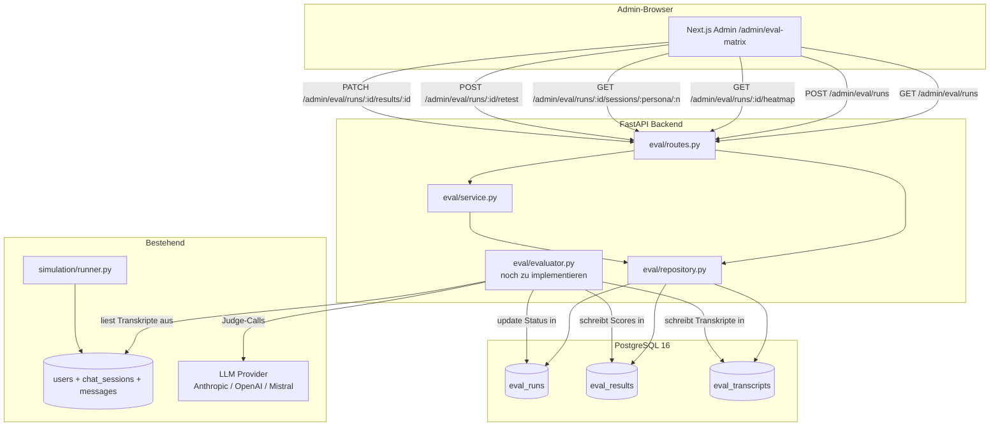
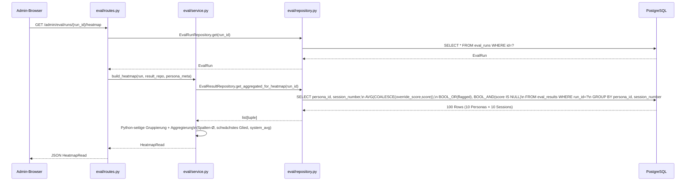
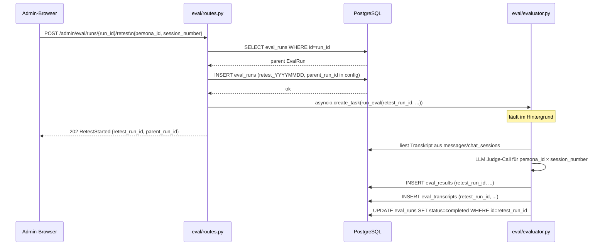

# Architektur: Session-Eval-Matrix (STORY-EVAL-MATRIX)

**Datum:** 2026-07-04
**Status:** Accepted
**Bezug:** ADR-002, UX-Spec docs/ux/STORY-EVAL-MATRIX-ux.md

---

## Komponentendiagramm



---

## Datenbankschema

```
eval_runs
  id             VARCHAR(100) PK       "eval_YYYYMMDD_HHMMSS"
  triggered_by   VARCHAR(100)          Admin-Username aus JWT
  status         VARCHAR(20)  IX       pending|running|completed|failed
  config         JSONB                 {persona_ids, session_numbers, persona_meta, ...}
  evaluator_model VARCHAR(80)          gepinnte Model-ID (nie generisch)
  total_cost_eur NUMERIC(10,6)         Summe aller Judge-Call-Kosten
  simulation_run_id VARCHAR(100) IX    FK zu simulation run (String, kein DB-FK)
  error          TEXT
  started_at     TIMESTAMPTZ
  finished_at    TIMESTAMPTZ

eval_results
  id             SERIAL PK
  run_id         VARCHAR(100) FK→eval_runs CASCADE
  persona_id     VARCHAR(50)            "P01_Schweiger"
  session_number SMALLINT               1–10
  metric_key     VARCHAR(40)            m1_socratic_purity | ... | m7_crisis_detection
  score          SMALLINT NULL          0–3, NULL wenn Judge fehlgeschlagen
  reasoning      TEXT NULL              LLM-Freitext-Begründung
  flagged        BOOLEAN                score<=1 oder crisis_triggered
  crisis_triggered BOOLEAN NULL         nur für M7
  override_score SMALLINT NULL          manuelle Admin-Korrektur
  override_reason TEXT NULL
  override_by    VARCHAR(100) NULL
  override_at    TIMESTAMPTZ NULL
  created_at     TIMESTAMPTZ

  INDEX: (run_id, persona_id, session_number)  ← Heatmap GROUP BY
  INDEX: (run_id, metric_key)                  ← Metrik-Filter

eval_transcripts
  id             SERIAL PK
  run_id         VARCHAR(100) FK→eval_runs CASCADE
  persona_id     VARCHAR(50)
  session_number SMALLINT
  messages       JSONB                  [{role, content, exchange_index, flagged}, ...]
  flagged_exchanges JSONB               [{index, criterion, user, kaia, flag_reason}, ...]
  overall_finding TEXT NULL             LLM-generierter Gesamt-Befund
  created_at     TIMESTAMPTZ

  UNIQUE: (run_id, persona_id, session_number)
  INDEX: (run_id, persona_id)
```

---

## Sequenzdiagramm: Heatmap laden



---

## Sequenzdiagramm: Retest starten



---

## API-Endpunkte

| Methode | Pfad | Beschreibung | Response |
|---------|------|--------------|---------|
| GET | `/api/v1/admin/eval/runs` | Alle Runs, neueste zuerst | `list[EvalRunRead]` |
| POST | `/api/v1/admin/eval/runs` | Run starten (async) | `202 EvalRunStarted` |
| GET | `/api/v1/admin/eval/runs/{run_id}/status` | Run-Status abfragen | `EvalRunRead` |
| GET | `/api/v1/admin/eval/runs/{run_id}/heatmap` | Heatmap-Daten | `HeatmapRead` |
| GET | `/api/v1/admin/eval/runs/{run_id}/sessions/{persona_id}/{session_number}` | Detail Persona × Session | `SessionDetailRead` |
| POST | `/api/v1/admin/eval/runs/{run_id}/retest` | Retest starten | `202 RetestStarted` |
| PATCH | `/api/v1/admin/eval/runs/{run_id}/results/{result_id}` | Manuelle Score-Korrektur | `{status, result_id}` |

Alle Endpunkte: Admin-Auth (Bearer JWT, `require_admin` dependency).

---

## Externe Abhängigkeiten

| Abhängigkeit | Zweck | Failure Mode |
|---|---|---|
| PostgreSQL 16 | Persistenz aller Eval-Daten | Kein Eval möglich — Run bleibt auf `pending` |
| LLM Provider (Judge) | Score-Generierung (M1–M7) | Evaluator schreibt `score=NULL`, `flagged=False`, `reasoning="Judge-Call fehlgeschlagen"` — Run wird als `completed` markiert mit Hinweis auf partielle Daten |
| `simulation/runner.py` (_runs in-memory) | Persona-Metadaten (learning_topic, sabotage_pattern) | Metadaten fehlen in Heatmap — `persona_meta={}` — kein Absturz, nur leere Felder |

---

## Identifizierte Risiken

**R1: Evaluator noch nicht implementiert**
`evaluator.py` ist ein Platzhalter-Import in `routes.py`. Beim Start eines Eval-Runs gibt die Route einen `ImportError` ab und markiert den Run als `failed`. Konsequenz: Admin sieht den Fehler im Status-Endpoint. Keine Datenverlust-Gefahr. Priorität: der ai-engineer implementiert `evaluator.py` als nächsten Schritt.

**R2: In-memory Persona-Metadaten**
`simulation/runner.py` hält Runs in `_runs: dict` im Speicher. Nach Server-Neustart sind die Metadaten (learning_topic, sabotage_pattern) weg. Lösung: Der Evaluator schreibt `persona_meta` beim Run-Start in `eval_runs.config`. Bis dahin: Heatmap zeigt leere Metadaten-Felder — kein funktionaler Bruch.

**R3: String-Run-IDs ohne Uniqueness-Guarantee**
Zwei gleichzeitig gestartete Runs in derselben Sekunde würden denselben `eval_YYYYMMDD_HHMMSS` produzieren. Wahrscheinlichkeit: vernachlässigbar (Admin-Tool, sequenziell bedient). Mitigation: PK-Constraint wirft `IntegrityError`, Route gibt 409 zurück.

**R4: JSONB `config` ist schemalos**
`persona_meta` in `config` muss vom Evaluator diszipliniert befüllt werden. Kein Schema-Enforcement in der DB. Mitigation: Pydantic-Validierung im Evaluator vor dem Schreiben, nicht in `routes.py`.

**R5: Score-Aggregation in Python statt SQL**
`build_heatmap` gruppiert die 100 Rows in Python, nicht in SQL. Bei 100 Zellen kein Performance-Problem. Wenn das Eval-System auf echte Nutzer-Sessions ausgeweitet wird (potenziell tausende Rows), muss die Aggregation in SQL verlagert werden.
