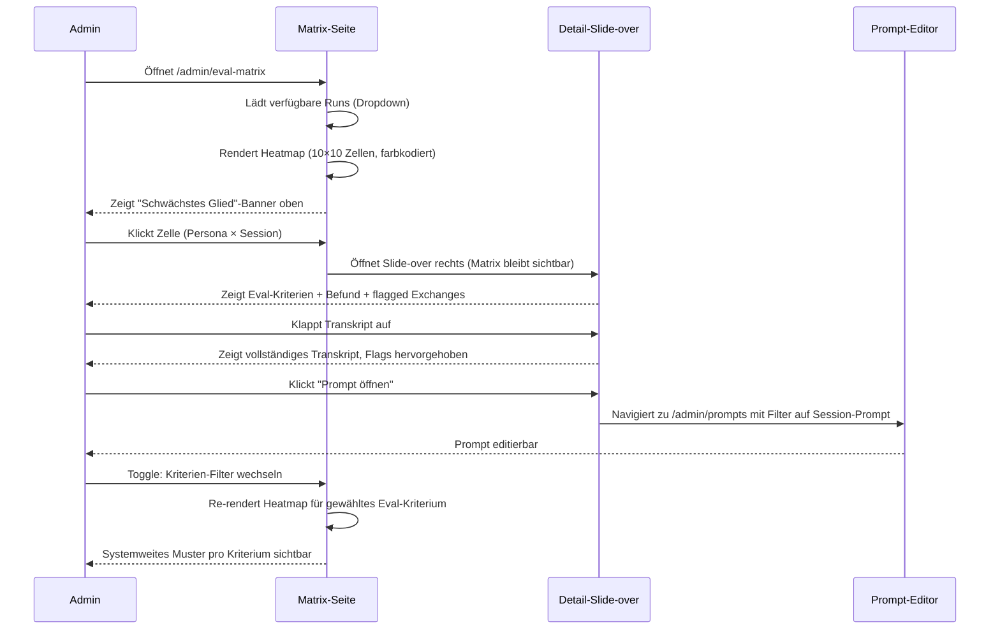

# UX-Design STORY-EVAL-MATRIX
## Session-Eval-Matrix — Admin-Diagnose-Tool

**Kontext:** Admin-internes Werkzeug. Kein Endnutzer-Kontakt.
**Job:** Prompt-Schwächen in KAIA systematisch lokalisieren, nicht browsen.
**Datenquelle:** Bestehende `RunResults`-Struktur aus Crash-Persona-Simulation, erweitert um Eval-Scores pro Session und Kriterium (Backend-Voraussetzung, s.u.).

---

## User Flows



---

## Screens / Zustände

### Hauptansicht: Matrix

```
┌─────────────────────────────────────────────────────────────────────────────────┐
│  Session-Eval-Matrix                                  Run: 2026-07-04 14:33  ▾ │
│  10 Personas × 10 Sessions — Gesamt-Score                    [Neuer Run →]     │
├─────────────────────────────────────────────────────────────────────────────────┤
│                                                                                 │
│  Schwächstes Glied:  PANIC_ANNA × Session 07  —  Score 28%          [Detail →] │
│  Systemweites Mittel: 61%   Fehler-Zellen: 3/100   Schlechteste Session: S07   │
│                                                                                 │
│  Zeige Kriterium: [Gesamt ▾]  [Sokratik]  [Empathie]  [Crisis-Det.]  [Kohärenz]│
│                                                                                 │
├──────────────────┬──────┬──────┬──────┬──────┬──────┬──────┬──────┬──────┬────┤
│ Persona          │ S 01 │ S 02 │ S 03 │ S 04 │ S 05 │ S 06 │ S 07 │ S 08 │ Ø  │
├──────────────────┼──────┼──────┼──────┼──────┼──────┼──────┼──────┼──────┼────┤
│ PANIC_ANNA       │  87  │  84  │  79  │  71  │  61  │  54  │  28* │  58  │ 65 │
│ AVOIDANT_BEN     │  91  │  88  │  85  │  74  │  68  │  55  │  51  │  49  │ 70 │
│ SPIRAL_CARA      │  94  │  92  │  90  │  88  │  86  │  84  │  79  │  52  │ 83 │
│ DEFLECT_DAVID    │  82  │  80  │  76  │  70  │  66  │  60  │  42  │  45  │ 65 │
│ NUMB_EVA         │  78  │  75  │  72  │  68  │  64  │  58  │  50  │  44  │ 64 │
│ RAGE_FRANK       │  88  │  !   │  …   │  …   │  …   │  …   │  …   │  …   │ !  │
│ …                │  …   │  …   │  …   │  …   │  …   │  …   │  …   │  …   │ …  │
├──────────────────┼──────┼──────┼──────┼──────┼──────┼──────┼──────┼──────┼────┤
│ Spalten-Ø        │  87  │  82  │  79  │  74  │  67  │  59  │  41* │  52  │ 68 │
└──────────────────┴──────┴──────┴──────┴──────┴──────┴──────┴──────┴──────┴────┘

* = niedrigster Wert dieser Zeile/Spalte  ! = Fehler/Simulation abgebrochen

Legende:  ≥75% grün  50–74% gelb  25–49% orange  <25% rot  ! Fehler grau
```

**Farbwerte (Tailwind / CSS-Tokens):**
- `>= 75`: `bg-emerald-500/20 text-emerald-700` (Dark: `text-emerald-400`)
- `50–74`: `bg-yellow-400/20 text-yellow-700` (Dark: `text-yellow-400`)
- `25–49`: `bg-orange-400/20 text-orange-700` (Dark: `text-orange-400`)
- `< 25`: `bg-red-500/20 text-red-700 ring-1 ring-red-500` (Dark: `text-red-400`)
- Fehler: `bg-gray-400/10 text-muted-foreground` + Ausrufezeichen-Icon

Zellen sind `<button>` mit `aria-label="PANIC_ANNA, Session 7, Score 28 Prozent, schlecht"`.

---

### Detail-Ansicht: Slide-over (rechts)

Öffnet als `position: fixed` Panel, 480px breit. Matrix bleibt links sichtbar und scrollbar. Kein Modal — der Admin soll die Gesamtlage im Blick behalten.

```
┌──────────────────────────────────────────────────────┐
│ [×] Schließen                                        │
│ PANIC_ANNA × Session 07              Score: 28%  rot │
│ Thema: Prüfungsvorbereitung Statistik                │
│ Sabotage: Katastrophisieren unter Druck              │
├──────────────────────────────────────────────────────┤
│ EVAL-KRITERIEN                                       │
│                                                      │
│ Sokratik (Fragenqualität)                            │
│ ░░░░░░░░░░░░░░░░░░░░░░░░░░░░░░░░░░ 20%  rot         │
│                                                      │
│ Empathie-Resonanz                                    │
│ █████████████████░░░░░░░░░░░░░░░░░ 60%  gelb        │
│                                                      │
│ Kein Instruktions-Slip                               │
│ ████████████████████████████░░░░░░ 80%  grün        │
│                                                      │
│ Crisis-Detection                                     │
│ ███████████████████████████████████ 100%  grün      │
│                                                      │
│ Themen-Kohärenz                       ← Hauptproblem │
│ ░░░░░░░░░░░░░░░░░░░░░░░░░░░░░░░░░░ 10%  rot         │
│                                                      │
│ Gesprächsführung                                     │
│ ██████████████░░░░░░░░░░░░░░░░░░░░ 40%  orange      │
│                                                      │
├──────────────────────────────────────────────────────┤
│ AUTOMATISCHER BEFUND                                 │
│ "KAIA hat ab Exchange 3 die Fragehaltung verlassen   │
│ und direkte Ratschläge formuliert (Instruktions-     │
│ Slip). Themen-Kohärenz bricht in Exchange 5 ein —   │
│ KAIA verliert das Lernziel aus dem Blick."           │
├──────────────────────────────────────────────────────┤
│ AUFFÄLLIGE EXCHANGES [3 von 8 flagged]        [▾]   │
│                                                      │
│ Exchange 3 — Instruktions-Slip                       │
│   USER: "Ich schaff das nie."                        │
│   KAIA: "Vielleicht solltest du die Formeln..."      │
│          ^─── Direkte Instruktion statt Frage        │
│                                                      │
│ Exchange 5 — Themenbruch                             │
│   USER: "Lass das. Rede mit mir über was anderes."   │
│   KAIA: "Du könntest versuchen, dich zu..."          │
│          ^─── Thema nicht gehalten                   │
│                                                      │
│ [Vollständiges Transkript anzeigen ▾]                │
├──────────────────────────────────────────────────────┤
│ [Prompt dieser Session öffnen →]                     │
└──────────────────────────────────────────────────────┘
```

---

### Ergänzungs-View: Verlaufsgraph pro Persona (Toggle)

Aktivierbar über Tab/Button über der Matrix: "Matrix | Verlauf"

```
Persona: [PANIC_ANNA ▾]

Score   100 |
         90 | ●
         80 |   ●
         70 |     ●
         60 |       ●
         50 |         ●
         40 |           ●
         28 |               ●  ← Bruchpunkt S07
         20 |
          0 +─────────────────────────────
             S01 S02 S03 S04 S05 S06 S07 S08

Legende: Punkte farbkodiert wie Matrix. Grenze 50% als gestrichelte Linie.
```

Zeigt Gedächtnis-Abbau / Drift über den Session-Verlauf. Ein kontinuierlich fallender Verlauf ist ein anderes Problem (Kontextverlust) als eine einzelne rote Zelle (punktuelles Prompt-Versagen).

---

### Leer-Zustand (kein Run vorhanden)

```
┌─────────────────────────────────────────────────────┐
│  Session-Eval-Matrix                                │
│                                                     │
│  Noch keine ausgewerteten Simulations-Runs.         │
│                                                     │
│  Voraussetzung: Ein Crash-Persona-Run muss          │
│  abgeschlossen sein UND der LLM-Evaluator muss      │
│  Scores pro Session/Kriterium berechnet haben.      │
│                                                     │
│  [Zur Simulations-Seite →]                          │
└─────────────────────────────────────────────────────┘
```

### Lade-Zustand

Skeleton: Matrix-Grundstruktur (Zeilen/Spalten sichtbar) mit pulsierenden Platzhalter-Zellen. Kein Spinner über die ganze Seite — der Admin soll die Dimensionen der Matrix schon während des Ladens sehen.

### Fehler-Zustand (einzelne Zellen)

Zelle zeigt `!`-Icon, Tooltip: "Simulation für diese Kombination abgebrochen". Zelle ist trotzdem klickbar — Slide-over zeigt Fehlermeldung + verfügbares Partial-Transkript.

### Fehler-Zustand (API nicht erreichbar)

Banner oben, nicht Modal:
`"Daten konnten nicht geladen werden. Prüfe die API-Verbindung. [Erneut versuchen]"`

---

## AI-Vertrauensdesign

Dieser Admin-Screen zeigt KI-generierte Eval-Scores und automatische Befunde. Das sind selbst KI-Outputs — der Admin muss das erkennen können.

**Confidence-Darstellung:**
- Automatischer Befund trägt dauerhaft den Hinweis: "Automatisch generiert — Einschätzung des LLM-Evaluators, nicht verifiziert."
- Kein Score wird als absolute Wahrheit dargestellt. Balken statt Prozentzahl als primäres visuelles Element (Balken kommunizieren Relativität, nackte Zahlen wirken präziser als sie sind).

**Quellen / Erklärbarkeit:**
- Jedes Eval-Kriterium verlinkt auf die Kriterien-Definition (Tooltip oder Link zur Doku: "Was bedeutet Sokratik-Score?")
- Flagged exchanges zeigen explizit, welches Kriterium ausgelöst hat

**Korrektur-/Feedback-Wege:**
- Admin kann einzelne Eval-Bewertungen manuell korrigieren ("Nicht einverstanden" + Freitext) — diese Korrekturen fließen in die Eval-Methodologie zurück
- Korrekturen werden in der Zelle mit einem Indikator markiert: `[M]` = manuell angepasst

**Fallback bei Ausfall:**
- Wenn der LLM-Evaluator keine Scores liefert, zeigt die Matrix den Status "nicht bewertet" (grau) statt leer — Unterschied zwischen "keine Daten" und "Fehler" ist visuell klar

---

## Accessibility-Check

- [ ] Kontrast >= 4.5:1 (Text), 3:1 (UI) — Heatmap-Farben dürfen NICHT die einzige Codierung sein: Jede Zelle zeigt zusätzlich den Score als Zahl. Farbenblinde Nutzer können die Tabelle lesen.
- [ ] Tastaturnavigation vollständig — Matrix-Zellen navigierbar mit Pfeiltasten (wie `role="grid"` mit `aria-rowindex`/`aria-colindex`); Slide-over mit Escape schließbar; Fokus kehrt zur auslösenden Zelle zurück
- [ ] Screen-Reader-Beschriftung — `<table>` mit `<caption>`, `<th scope="col">` für Session-Spalten, `<th scope="row">` für Persona-Zeilen; Zellen mit `aria-label` das Persona, Session und Score enthält; Heatmap-Farbe über `aria-describedby` mit Legende verknüpft
- [ ] Fokus-Indikatoren sichtbar — `focus-visible:ring-2 ring-offset-2` auf allen interaktiven Elementen; Ring kontrastiert gegen Zellen-Hintergrund
- [ ] Sprache klar — Eval-Kriterien in Alltagssprache erklärt (Tooltip: "Sokratik" = "Stellt KAIA echte Fragen statt Antworten zu geben?"); Befund-Texte auf B2-Niveau
- [ ] Bewegung respektiert prefers-reduced-motion — Slide-over öffnet ohne Animation bei `prefers-reduced-motion: reduce`; Skeleton-Puls deaktiviert

**Zusätzliche Tabellen-Accessibility:**
- `role="grid"` mit Arrow-Key-Navigation (nicht `role="table"` — Grid ermöglicht interaktive Cells)
- Zellen-Buttons haben `tabindex="-1"` außer der focused cell (`tabindex="0"`) — Roving-Tabindex-Pattern
- Summary-Banner ("Schwächstes Glied") hat `role="status"` und `aria-live="polite"` — wird nach Run-Wechsel neu vorgelesen

---

## Compliance-UX

Diese Seite ist rein admin-intern. Kein personenbezogenes Datum echter Studienteilnehmender wird angezeigt (Personas sind synthetisch). Trotzdem:

**Transparenzhinweise:**
- Befund-Texte tragen dauerhaft: "Automatisch generiert vom LLM-Evaluator" — damit ist klar, dass die Diagnose selbst KI-Output ist (EU AI Act Art. 50 gilt zwar nicht für Admin-Interna, aber der Grundsatz der Selbst-Transparenz gilt)
- Run-Metadaten zeigen: welches LLM-Modell den Eval durchgeführt hat (nicht nur "Evaluator" — sondern z.B. "claude-3-5-sonnet-20241022")

**Einwilligungen:** Nicht anwendbar (kein Endnutzer-Kontakt).

**Datenrechte-Pfade:** Nicht anwendbar (synthetische Personas).

**Studienschutz:**
- Die Seite darf keinen Rückschluss auf echte Teilnehmende ermöglichen. Wenn zukünftig echte Session-Daten einbezogen werden, muss vor Implementierung eine DSFA gemacht werden.

---

## Mikrotexte

| Element | Text |
|---|---|
| Seiten-Heading | "Session-Eval-Matrix" |
| Seiten-Subline | "Prompt-Schwächen systematisch lokalisieren — 10 Personas × 10 Sessions" |
| Run-Dropdown-Label | "Run auswählen" |
| Run-Dropdown-Empty | "Noch keine abgeschlossenen Runs" |
| Schwächstes-Glied-Banner | "Schwächstes Glied: [PERSONA] × Session [N] — Score [X]%" |
| Mittelwert-Zeile Label | "Spalten-Durchschnitt" |
| Mittelwert-Spalte Label | "Gesamt-Ø" |
| Kriterium-Toggle Label | "Zeige Kriterium:" |
| Kriterium-Option Gesamt | "Gesamtscore" |
| Slide-over Schließen | "Schließen" (+ ×-Icon; aria-label: "Detailansicht schließen") |
| Slide-over Sabotage-Label | "Sabotage-Muster:" |
| Befund-Section-Label | "Automatischer Befund" |
| Befund-Disclaimer | "Automatisch generiert — Einschätzung des LLM-Evaluators ([modell-id]), nicht manuell verifiziert." |
| Flagged-Exchanges-Label | "Auffällige Exchanges" |
| Transkript-Button Collapsed | "Vollständiges Transkript anzeigen" |
| Transkript-Button Expanded | "Transkript einklappen" |
| Prompt-Link | "Prompt dieser Session öffnen" |
| Manuelle-Korrektur-Button | "Bewertung korrigieren" |
| Manuelle-Korrektur-Tooltip | "Deine Korrektur wird gespeichert und in der Eval-Methodik dokumentiert." |
| Fehler-Zelle Tooltip | "Simulation für diese Kombination abgebrochen. Klick für Fehlerdetails." |
| Leer-Zustand Heading | "Noch keine Eval-Daten vorhanden" |
| Leer-Zustand Text | "Voraussetzung: Ein abgeschlossener Simulations-Run mit LLM-Evaluator-Scoring." |
| Leer-Zustand Link | "Zur Simulations-Seite" |
| API-Fehler Banner | "Daten konnten nicht geladen werden. Prüfe die API-Verbindung." |
| API-Fehler Retry | "Erneut versuchen" |
| View-Toggle Matrix | "Matrix" |
| View-Toggle Verlauf | "Verlauf" |
| Verlauf Persona-Label | "Persona:" |
| Score-Schwelle-Label | "Grenze: 50%" |
| Legende-Label >= 75 | "Gut (≥ 75%)" |
| Legende-Label 50-74 | "Mittel (50–74%)" |
| Legende-Label 25-49 | "Schwach (25–49%)" |
| Legende-Label < 25 | "Kritisch (< 25%)" |
| Legende-Label Fehler | "Simulation fehlgeschlagen" |

---

## Backend-Voraussetzungen (kein UX, aber Dependency)

Diese UX setzt voraus, dass das Backend liefert:

```
GET /api/v1/admin/simulation/eval-matrix/{run_id}

Response:
{
  "run_id": "...",
  "personas": [
    {
      "codename": "PANIC_ANNA",
      "learning_topic": "...",
      "sabotage_pattern": "...",
      "sessions": [
        {
          "session_number": 7,
          "score_total": 28,
          "scores_by_criterion": {
            "sokratik": 20,
            "empathie": 60,
            "kein_instruktions_slip": 80,
            "crisis_detection": 100,
            "themenkohärenz": 10,
            "gespraechsfuehrung": 40
          },
          "befund": "KAIA hat ab Exchange 3...",
          "evaluator_model": "claude-3-5-sonnet-20241022",
          "flagged_exchanges": [
            {
              "index": 3,
              "criterion": "kein_instruktions_slip",
              "user": "...",
              "kaia": "...",
              "flag_reason": "Direkte Instruktion statt Frage"
            }
          ],
          "transcript": [...]
        }
      ]
    }
  ]
}
```

Ohne diesen Endpunkt ist die Matrix ein leerer Rahmen. Die Simulation-Seite erzeugt Transkripte — der LLM-Evaluator muss die Transkripte nachträglich bewerten. Das ist ein separater Implementierungsschritt.

---

## Übergabe an security

Threat-relevante Punkte:
1. Der neue Endpunkt `/admin/simulation/eval-matrix/{run_id}` muss dieselbe Admin-Auth wie die bestehenden Simulation-Endpunkte erhalten (Bearer-Token-Check).
2. `run_id` ist ein Path-Parameter — muss auf Ownership geprüft werden (kein anderer Run abrufbar durch ID-Enumeration).
3. Wenn manuelle Korrekturen gespeichert werden (Eval-Override), muss der Schreibpfad separat abgesichert und auditiert werden.
4. Befund-Texte werden vom LLM generiert — kein XSS durch ungesanitized Rendering. Befund immer als Plaintext rendern, kein `dangerouslySetInnerHTML`.
