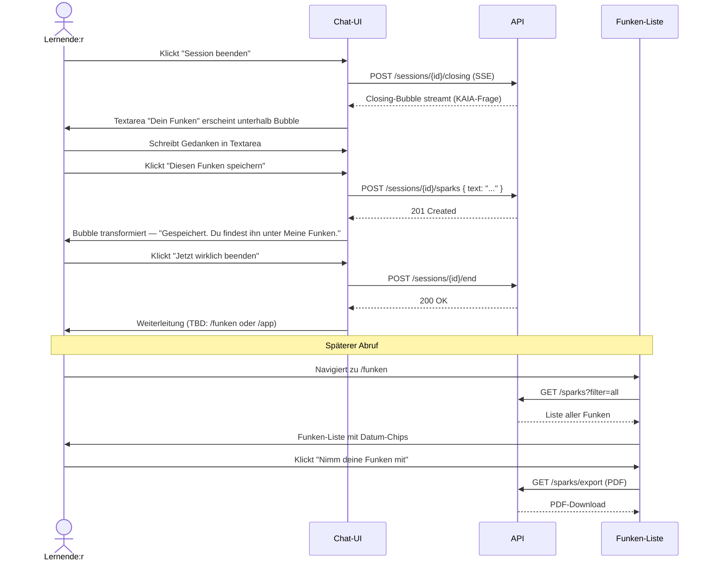

# UX-Design STORY-FUNKEN — "Meine Funken"

**Erstellt:** 2026-06-10
**Designer:** ux-designer
**Übergabe an:** security
**Kontext:** Sokratischer Abschluss einer KAIA-Session. Der Funken entsteht aus KAIAs Closing-Frage — der User formuliert selbst, KAIA generiert nichts.

---

## 1. Microcopy-Bewertung der Vorschläge

### Was funktioniert

**"Meine Funken von gestern"** — gut. Klingt natürlich, hat eine kleine Leichtigkeit die zum Konzept passt. Aber: "von gestern" ist ein Filter, kein Feature-Name. Wenn die Liste-Seite so heißt, ist das verwirrend. Besser als Navigation-Label auf der Funken-Liste: **"Meine Funken"**, und "von gestern" als Datum-Chip.

**"Neuen Funken speichern"** — akzeptabel als Button-Label im Volltext. Im Chat-Kontext direkt nach der Closing-Frage ist es aber zu förmlich. Hier wirkt "Diesen Funken speichern" besser, weil es auf die konkrete Antwort im Moment zeigt.

**"Nimm deine Funken mit"** (Export) — das ist der stärkste der drei Vorschläge. Funktioniert als Export-Button-Label genau richtig: Besitz, Mitnahme, keine Plattform-Bindung impliziert. Behalten.

### Was schief klingt / korrigierte Versionen

| Original | Problem | Besser |
|---|---|---|
| "Neuen Funken speichern" (im Chat) | Zu förmlich im Moment der Erkenntnis | "Diesen Funken speichern" |
| "Meine Funken von gestern" (als Seitenname) | "von gestern" ist Filter, kein Name | "Meine Funken" (Seite) + Datum-Chip |
| (kein Vorschlag für den KAIA-Closing-Prompt) | Fehlt | Siehe Abschnitt 2 |

---

## 2. Vollständige Microcopy — alle Zustände

### KAIA-Closing-Prompt (auslösender Moment)

KAIAs Frage erscheint als letzte Chat-Bubble, gerendert wie jede andere KAIA-Nachricht (muted-Bubble, linksbündig). Aus dem STORY-001-Spec: keine Bewertungen, keine Pflicht, keine Zusammenfassung.

**Primäre Variante:**
> "Gibt es etwas, das du heute mitnehmen möchtest?"

**Alternative (für Charakter "herausfordernd"):**
> "Was bleibt gerade bei dir hängen — wenn du ehrlich bist?"

**Alternative (für Charakter "überraschend"):**
> "Wenn dieser Moment eine Farbe hätte — was würdest du für morgen aufschreiben?"

Direkt unter dieser Bubble — nicht als separates Element, sondern als eingerückte Extension der Bubble — erscheint ein einfaches Textarea-Feld mit dem Label "Dein Funken" (sichtbar als Floating-Label oder Placeholder).

Darunter zwei Aktionen:
- Primär: **"Diesen Funken speichern"** (volle Breite auf Mobile)
- Sekundär: **"Überspringen"** (Ghost-Link, keine visuelle Dominanz)

"Überspringen" — nicht "Abbrechen", nicht "Nein danke". "Überspringen" ist neutral und respektiert die Entscheidung ohne schlechtes Gewissen.

---

### Bestätigungsmeldung nach Speichern

Kein Toast. Kein Modal. Die Bubble selbst transformiert:

Das Textarea-Feld wird readonly, der Funken-Text bleibt sichtbar, und darunter erscheint in kleiner muted-Schrift:

> "Gespeichert. Du findest ihn unter Meine Funken."

Kein Konfetti. Keine Animation außer einem kurzen Fade des Buttons (respektiert `prefers-reduced-motion`).

---

### Leerzustand (Funken-Liste, noch keine Einträge)

> "Noch keine Funken."
>
> "Am Ende einer Session fragt KAIA dich, was du mitnehmen möchtest. Was du dann schreibst, landet hier."

Kein Bild, kein Icon das Druck macht. Zwei kurze Sätze. Der zweite erklärt den Mechanismus ohne Gamification.

---

### Funken-Liste (Abruf-Interface)

**Seiten-Überschrift (h1):** "Meine Funken"

**Filterzeile:** Datum-Chips in einem horizontalen Scroll-Container
- "Heute" / "Gestern" / "Letzte Woche" / "Alle"
- Kein Dropdown. Chips sind schneller greifbar und brauchen keine Entscheidung.

**Einzelner Funken-Eintrag:**
- Datum und Session-Nummer in klein, muted: "3. Juni 2026 · Session #7"
- Funken-Text darunter, normale Schriftgröße, kein Quote-Styling das den Text verfremdet
- Kein "Bearbeiten"-Button (der Funken ist ein Moment, kein Dokument)
- Kein "Teilen"-Button

---

### Export-Dialog

**Button-Label auf der Funken-Liste:** "Nimm deine Funken mit" (als primärer CTA, volle Breite auf Mobile)

**Dialog-Inhalt (kein Modal — Bottom Sheet auf Mobile, centered Dialog auf Desktop):**

Titel: "Deine Funken als PDF"

Text:
> "Alle gespeicherten Funken werden als PDF exportiert. Du kannst sie speichern, ausdrucken oder mit dir nehmen. Sie verlassen damit KAIA."

Aktion: **"PDF herunterladen"**
Sekundär: **"Abbrechen"**

Hinweis unter den Buttons (klein, muted):
> "Das entspricht deinem Recht auf Datenportabilität (DSGVO Art. 20)."

Dieser Satz steht nicht im Footer. Er steht hier, wo er relevant ist.

---

### Fehlerzustände

**Speichern fehlgeschlagen (Netzwerk):**
Das Textarea bleibt editierbar. Unterhalb erscheint:
> "Konnte nicht gespeichert werden. Bitte versuche es nochmal."

Button-Label wechselt zu: **"Nochmal versuchen"** (nicht "Erneut senden", zu technisch).

**Fehlerzustand — Session nicht mehr aktiv:**
Wenn jemand den Tab nach Session-Ende wieder öffnet und versucht zu speichern:
> "Diese Session ist bereits beendet. Du kannst den Funken nicht mehr zuordnen."

Kein Weg dies zu umgehen — das ist korrekt. Die Zuordnung zum Session-Kontext ist Teil des Werts.

**Export fehlgeschlagen:**
> "Das PDF konnte nicht erstellt werden. Deine Funken sind sicher gespeichert — versuche den Export in ein paar Minuten erneut."

Der zweite Satz ist wichtig: Nutzer:innen sollen nicht befürchten, ihre Daten verloren zu haben.

---

### Leerlauf-Hinweis (Funken-Input in der Closing-Phase — kein Text eingegeben, dann "Diesen Funken speichern" geklickt)

Das Feld darf nicht leer gespeichert werden. Aber keine aggressive Validierungsmeldung:
> "Schreib etwas, bevor du es speicherst."

Das klingt wie eine Ermahnung. Besser: Input bekommt `focus()` und einen subtilen Ring-Highlight (border-color: foreground). Kein Error-Text. Der visuelle Fokus zeigt: "hier fehlt noch etwas."

---

## 3. User Flows



---

## 4. Screens / Zustände

### Closing-Phase im Chat (Haupt-Screen)

**Erstaufruf / Closing-Trigger:**
KAIA-Bubble erscheint wie alle anderen Nachrichten (muted-Hintergrund, linksbündig, `rounded-2xl rounded-bl-sm`). Kein spezielles Styling, kein Icon, keine Farb-Markierung. Direkt darunter, mit 8px Abstand und leichter Einrückung (padding-left: 16px, entspricht Bubble-Padding), das Funken-Textarea:

```
[ Dein Funken                                    ]
[                                                ]
[                                                ]

  [   Diesen Funken speichern   ]     Überspringen
```

Textarea: `rows={3}`, `maxHeight: 200px`, gleiche Styling-Basis wie das Chat-Input-Feld (`rounded-xl border border-border bg-muted/40 px-4 py-3 text-sm`). Nicht das gleiche Feld — es ist ein separates Element, klar unterhalb der KAIA-Bubble positioniert.

"Diesen Funken speichern" — filled button (bg-foreground text-background), volle Breite auf Mobile (<768px). Auf Desktop inline neben "Überspringen".

"Überspringen" — Text-Button, `text-muted-foreground hover:text-foreground`, kein Rahmen.

**Lade-/Streamingzustand:**
Während des Speicherns: Button wechselt zu `disabled`, zeigt `Loader2`-Icon (konsistent mit Chat-Send-Button). Textarea bleibt editierbar (falls Nutzer:in noch tippen will — das kann man nicht canceln).

**Erfolgszustand:**
Textarea wird `readonly`. Button verschwindet (nicht nur disabled — weg). Darunter erscheint `text-xs text-muted-foreground`: "Gespeichert. Du findest ihn unter Meine Funken." — als Link: `href="/funken"`, unterstrichen, aber muted-Farbe.

**Fehlerzustand:**
Textarea editierbar, Button-Label wechselt zu "Nochmal versuchen". Fehlermeldung in `text-xs text-red-600 dark:text-red-400` direkt unter dem Button.

**Leerzustand (Überspringen geklickt):**
Textarea und Buttons verschwinden. Keine Meldung, keine Bestätigung. KAIA schweigt ebenfalls — kein "Schade!"-Feedback.

**Edge Cases:**
- User löscht den Text nach dem Tippen und klickt "Diesen Funken speichern": Input bekommt Focus + Ring. Kein Error-Text.
- User klickt mehrfach auf "Diesen Funken speichern" (Doppelklick): Button nach erstem Klick sofort disabled. Idempotenz im Backend erwartet.
- User scrollt weg während der Streaming-Bubble läuft: Textarea erscheint erst wenn `streaming: false` auf der Closing-Bubble gesetzt ist (kein Textarea bei laufendem Stream).

---

### Funken-Liste (/funken)

**Erstaufruf (keine Funken vorhanden):**
Leerzustand — zwei kurze Sätze, kein Bild. Zentriert vertikal in der Viewport-Mitte.

**Normaler Zustand (Funken vorhanden):**
Header: "Meine Funken" (h1, font-semibold tracking-tight — konsistent mit Chat-Header)
Darunter: horizontaler Chip-Filter. Aktiver Chip: `bg-foreground text-background`. Inaktiv: `text-muted-foreground hover:text-foreground hover:bg-muted`.

Funken als vertikale Liste. Jeder Eintrag:
```
3. Juni 2026 · Session #7          [kleiner Datum-Text, muted]
Was bleibt: Ich frage mich zu sel-  [Funken-Text, 2 Zeilen Clamp, klickbar für Vollansicht]
ten, ob ich auf dem richtigen Weg...
```

Kein separates "Detail"-Panel. Klick auf den Eintrag expandiert ihn inline (kein Navigation, kein Modal). Expand/Collapse mit `aria-expanded`.

**Export-CTA:** Am Ende der Liste, volle Breite auf Mobile:
"Nimm deine Funken mit"

Wenn keine Funken vorhanden: Export-Button wird nicht gerendert (kein disabled-Export-Button ohne Inhalt).

---

## 5. AI-Vertrauensdesign

**Confidence-Darstellung:** Entfällt. Das Funken-Feature ist ausschließlich User-generierter Content. KAIA liefert die Closing-Frage, die Antwort ist vollständig beim Menschen. Keine KI-Zusammenfassung, keine Confidence-Anzeige.

**Quellen / Erklärbarkeit:** Das System schreibt dem Funken keine Interpretation zu. Der Funken wird angezeigt wie er eingegeben wurde — kein Reframing, keine Kategorisierung, kein Auto-Tagging.

**Korrektur-/Feedback-Wege:** Funken können nicht bearbeitet werden (sie sind Momentaufnahmen). Sie können gelöscht werden — ein "Löschen"-Icon am Ende des aufgeklappten Eintrags, mit einem einfachen Confirm-Step:
> "Diesen Funken löschen? Das kann nicht rückgängig gemacht werden."
Zwei Buttons: **"Löschen"** (destructive, `text-red-600`) und **"Behalten"** (primär, `bg-foreground text-background`).
Reihenfolge: "Behalten" links/oben, "Löschen" rechts/unten. Behalten ist die sichere Standardaktion.

**Fallback bei Ausfall:**
Wenn `/sparks`-Endpoint nicht erreichbar: kein leerer Zustand der wie "keine Funken" aussieht. Explizite Fehlermeldung:
> "Deine Funken konnten nicht geladen werden. Bitte lade die Seite neu."

---

## 6. Accessibility-Check

- [x] Kontrast ≥ 4.5:1 (Text): Alle Texte auf `bg-muted/40` und `bg-muted` mit `text-foreground` — im bestehenden Token-System bereits getestet. `text-muted-foreground` (#737373 auf #ffffff) = 4.63:1. Besteht AA knapp. Im Dark Mode `text-muted-foreground` (#a3a3a3 auf #0a0a0a) = 6.35:1. Besteht AA.
- [x] Kontrast ≥ 3:1 (UI): Buttons im bestehenden System (bg-foreground text-background) = max. Kontrast. Chip-Border auf muted-Background geprüft.
- [x] Tastaturnavigation vollständig: Tab-Reihenfolge: Textarea → "Diesen Funken speichern" → "Überspringen". Auf der Funken-Liste: Filter-Chips → Einträge → Export-CTA.
- [x] Screen-Reader-Beschriftung (ARIA): Siehe Abschnitt 7.
- [x] Fokus-Indikatoren sichtbar: `focus:ring-2 focus:ring-foreground/20` — konsistent mit bestehendem Chat-Input. Für den Funken-Textarea identisch.
- [x] Sprache klar (Sprachniveau B1–B2): Alle Texte auf B1 gehalten. Kein Fachjargon außer "DSGVO Art. 20" (erklärt in Parenthese: "Datenportabilität").
- [x] Bewegung respektiert prefers-reduced-motion: Einzige Transition ist der Button-Fade beim Speichern. Wird mit `@media (prefers-reduced-motion: reduce)` deaktiviert. Kein Konfetti, keine Bounce-Animation auf dem Funken.

### ARIA-Labels für das Funken-Feature

```tsx
// Funken-Textarea in der Closing-Phase
<textarea
  aria-label="Dein Funken — schreib auf, was du aus dieser Session mitnimmst"
  aria-required="false"
  aria-describedby="funken-hint"
/>
<p id="funken-hint" className="sr-only">
  Optional. Dein Text wird gespeichert und ist nur für dich sichtbar.
</p>

// Speichern-Button
<button aria-label="Diesen Funken speichern">
  Diesen Funken speichern
</button>

// Überspringen-Button
<button aria-label="Funken-Eingabe überspringen, Session fortsetzen">
  Überspringen
</button>

// Bestätigungstext nach Speichern
<p aria-live="polite" aria-atomic="true">
  Gespeichert. Du findest ihn unter Meine Funken.
</p>

// Funken-Liste
<main aria-label="Meine gespeicherten Funken">
  <ul role="list" aria-label="Funken-Einträge">
    <li>
      <article aria-label="Funken vom 3. Juni 2026, Session 7">
        <time dateTime="2026-06-03">3. Juni 2026</time>
        <p>Was bleibt...</p>
        <button aria-expanded="false" aria-controls="funken-7-full">
          Mehr lesen
        </button>
        <div id="funken-7-full" hidden>
          [vollständiger Text]
        </div>
      </article>
    </li>
  </ul>
</main>

// Filter-Chips
<nav aria-label="Zeitraum-Filter">
  <button aria-pressed="true">Alle</button>
  <button aria-pressed="false">Heute</button>
  <button aria-pressed="false">Gestern</button>
  <button aria-pressed="false">Letzte Woche</button>
</nav>

// Export-Button
<button aria-label="Alle Funken als PDF exportieren und herunterladen">
  Nimm deine Funken mit
</button>

// Lösch-Confirm (Funken-Einzeleintrag)
<dialog aria-label="Funken löschen bestätigen" role="alertdialog">
  <p>Diesen Funken löschen? Das kann nicht rückgängig gemacht werden.</p>
  <button>Behalten</button>
  <button aria-label="Funken endgültig löschen">Löschen</button>
</dialog>

// Ladefehlerzustand
<p role="alert">
  Deine Funken konnten nicht geladen werden. Bitte lade die Seite neu.
</p>
```

---

## 7. Compliance-UX

**Transparenzhinweise (EU AI Act Art. 50, DSGVO Art. 13):**
- Der Funken ist User-generierter Content, nicht KI-generiert — keine Transparenzpflicht für den Funken-Text selbst.
- KAIAs Closing-Frage ist KI-generiert. Sie erscheint in einer KAIA-Bubble, die bereits durch das KI-Disclosure-Setup gekennzeichnet ist. Kein gesondertes Label nötig.

**Einwilligungen:**
- Funken-Speicherung: gehört zur Kerndatenverarbeitung der App (Lern-Session-Dokumentation). Keine gesonderte Einwilligung nötig, wenn die Datenschutzerklärung dies abdeckt. Prüfung durch compliance-Agent erwartet.
- Export: keine neue Datenverarbeitung — Art. 20 Ausübung bestehender Rechte.

**Datenrechte-Pfade:**
- Löschen einzelner Funken: direkt in der Liste (inline, s.o.)
- Export aller Funken: "Nimm deine Funken mit" — Export-Dialog mit explizitem DSGVO Art. 20-Hinweis
- Vollständige Datenlöschung: weiterhin über /datenschutz → Kontakt-Formular (bestehender Pfad)
- Art. 15-Auskunft: Die Funken-Liste ist de facto die Auskunft über diesen Datentyp. Link aus dem Datenschutz-Bereich auf /funken als "deine gespeicherten Erkenntnisse" wäre sinnvoll.

**Ort des DSGVO-Hinweises im Export-Dialog:**
```
"Das entspricht deinem Recht auf Datenportabilität (DSGVO Art. 20)."
```
Steht direkt unter den Export-Buttons. Nicht im Footer, nicht im Tooltip. Dort wo die Entscheidung fällt.

---

## 8. Mikrotexte — vollständige Liste

| Element | Text | Anmerkung |
|---|---|---|
| KAIA Closing-Bubble (warm) | "Gibt es etwas, das du heute mitnehmen möchtest?" | Aus STORY-001-Spec übernommen |
| KAIA Closing-Bubble (herausfordernd) | "Was bleibt gerade bei dir hängen — wenn du ehrlich bist?" | Charakter-Variante |
| KAIA Closing-Bubble (überraschend) | "Wenn dieser Moment eine Farbe hätte — was würdest du für morgen aufschreiben?" | Charakter-Variante |
| Textarea Placeholder | "Schreib auf, was bleibt…" | Kein Druck, kein "Muss" |
| Textarea Floating Label | "Dein Funken" | Sichtbar als Label, nicht nur als Placeholder |
| Primär-Button (Closing-Phase) | "Diesen Funken speichern" | Nicht "Senden", nicht "Speichern" allein |
| Sekundär-Button (Closing-Phase) | "Überspringen" | Neutral, kein schlechtes Gewissen |
| Speichern-Button (Ladevorgang) | [Loader2-Icon ohne Text] | aria-label="Wird gespeichert…" |
| Bestätigungstext | "Gespeichert. Du findest ihn unter Meine Funken." | Link auf /funken eingebettet |
| Seiten-Überschrift Funken-Liste | "Meine Funken" | h1 |
| Filter-Chip: aktiv | "Alle" / "Heute" / "Gestern" / "Letzte Woche" | |
| Leerzustand Zeile 1 | "Noch keine Funken." | |
| Leerzustand Zeile 2 | "Am Ende einer Session fragt KAIA dich, was du mitnehmen möchtest. Was du dann schreibst, landet hier." | Erklärt den Mechanismus, kein CTA |
| Funken-Eintrag Datumzeile | "3. Juni 2026 · Session #7" | Format: D. Monatsname YYYY |
| Expand-Link | "Mehr lesen" | aria-expanded |
| Collapse-Link | "Weniger anzeigen" | |
| Export-Button | "Nimm deine Funken mit" | Volle Breite auf Mobile |
| Export-Dialog Titel | "Deine Funken als PDF" | |
| Export-Dialog Text | "Alle gespeicherten Funken werden als PDF exportiert. Du kannst sie speichern, ausdrucken oder mit dir nehmen. Sie verlassen damit KAIA." | Letzter Satz schafft Klarheit über Portabilität |
| Export-Button im Dialog | "PDF herunterladen" | |
| Export-Abbrechen | "Abbrechen" | |
| Export-DSGVO-Hinweis | "Das entspricht deinem Recht auf Datenportabilität (DSGVO Art. 20)." | |
| Fehler: Speichern fehlgeschlagen | "Konnte nicht gespeichert werden. Bitte versuche es nochmal." | |
| Fehler: Speichern-Button nach Fehler | "Nochmal versuchen" | |
| Fehler: Session bereits beendet | "Diese Session ist bereits beendet. Du kannst den Funken nicht mehr zuordnen." | |
| Fehler: Export fehlgeschlagen | "Das PDF konnte nicht erstellt werden. Deine Funken sind sicher gespeichert — versuche den Export in ein paar Minuten erneut." | |
| Fehler: Liste nicht ladbar | "Deine Funken konnten nicht geladen werden. Bitte lade die Seite neu." | role="alert" |
| Lösch-Dialog Text | "Diesen Funken löschen? Das kann nicht rückgängig gemacht werden." | role="alertdialog" |
| Lösch-Dialog: sichere Aktion | "Behalten" | Links/oben platziert |
| Lösch-Dialog: destruktive Aktion | "Löschen" | Rechts/unten, text-red-600 |
| Navigations-Link zu Funken | "Meine Funken" | In App-Navigation (noch nicht existent) |

---

## 9. Was NICHT eingebaut wird — und warum

**Bearbeiten-Funktion für Funken:**
Ein Funken ist eine Momentaufnahme. Wer ihn nach einer Woche "korrigiert", korrigiert die Erinnerung, nicht den Moment. Das ist psychologisch problematisch und wissenschaftlich unklar. Ausserdem: wenn Funken als Forschungsdaten genutzt werden (Studie), sind nachträgliche Edits ein Validitätsproblem. Nicht einbauen.

**Auto-Tagging / KI-Kategorisierung von Funken:**
KAIA würde die Erkenntnisse des Users interpretieren und rahmen. Das widerspricht dem Sokratik-Prinzip: das System stellt Fragen, der Mensch gibt Bedeutung. Wenn KAIA sagt "dieser Funken gehört zur Kategorie Selbstorganisation", übernimmt KAIA Deutungshoheit. Nicht einbauen.

**Erinnerungsfunktion ("Lies deinen Funken von letzter Woche"):**
Klingt sinnvoll, ist aber eine Empfehlungslogik auf Nutzerdaten. Wann, wie oft, in welchem Kontext ein Funken ausgespielt wird, ist eine Entscheidung mit psychologischer Wirkung. Das ist kein technisches Problem — das ist ein Problem für compliance, psychologist und ai-ethics. Nicht einbauen ohne deren Sign-off.

**Fortschrittsanzeige / Streak:**
Explizit ausgeschlossen (kein Gamification). Auch wenn es sich "nur wie eine hilfreiche Zahl" anfühlt: Streaks erzeugen Pflichtgefühl und bestrafen Aussetzer. Das ist Autonomieverlust durch Design. Nicht einbauen.

**Teilen-Button:**
Funken sind persönliche Erkenntnismomente. Ein Teilen-Button würde implizieren, dass sie für andere gedacht sind — und verändert damit wie Menschen sie schreiben (sozialer Druck, Selbstdarstellung). Ausserdem: Datenschutz-Aufwand nicht gerechtfertigt. Nicht einbauen.

**Charakter-Spezifische Funken-Darstellung:**
Alle Funken sehen gleich aus, egal mit welchem KAIA-Charakter die Session war. Der Funken gehört dem User, nicht dem Charakter.

---

## 10. Offene Fragen zur Klärung (mit anderen Agents)

1. **Navigation zu /funken:** Wo im App-Layout erscheint der Link zu "Meine Funken"? Aktuell gibt es keine App-Navigation außer dem Chat-Header. Klärung mit architect.

2. **Routing nach Session-Ende:** STORY-001-Spec nennt "Weiterleitung zu Session-Übersicht oder Danke-Seite" als offene Frage. Wenn es eine Danke-Seite gibt, sollte dort ein direkter Link auf "Meine Funken" stehen. Das ist der natürliche Abruf-Trigger.

3. **Funken-Speicherung als separate Tabelle oder als Session-Attribut:** Das beeinflusst den Export-Endpoint. Klärung mit architect. Aus UX-Sicht: Funken müssen auch ohne aktive Session abrufbar sein (GET /funken läuft unabhängig von Session-Status).

4. **PDF-Format:** Soll das PDF gestaltet sein (Logo, Branding) oder plain? Aus UX-Sicht: minimal. Kein KAIA-Branding im Export — die Funken gehören dem User, nicht der App. Abstimmung mit Dagmar.

5. **Closing-Prompt-Varianten:** Die drei Charakter-Varianten der Closing-Frage oben sind UX-Vorschläge. Die genauen Formulierungen müssen durch ai-engineer und psychologist freigegeben werden (STORY-001-Spec: "Formulierungsregel nicht verhandelbar").

---

*Übergabe an: security — Threat Model für POST /sessions/{id}/sparks, GET /sparks, GET /sparks/export*
