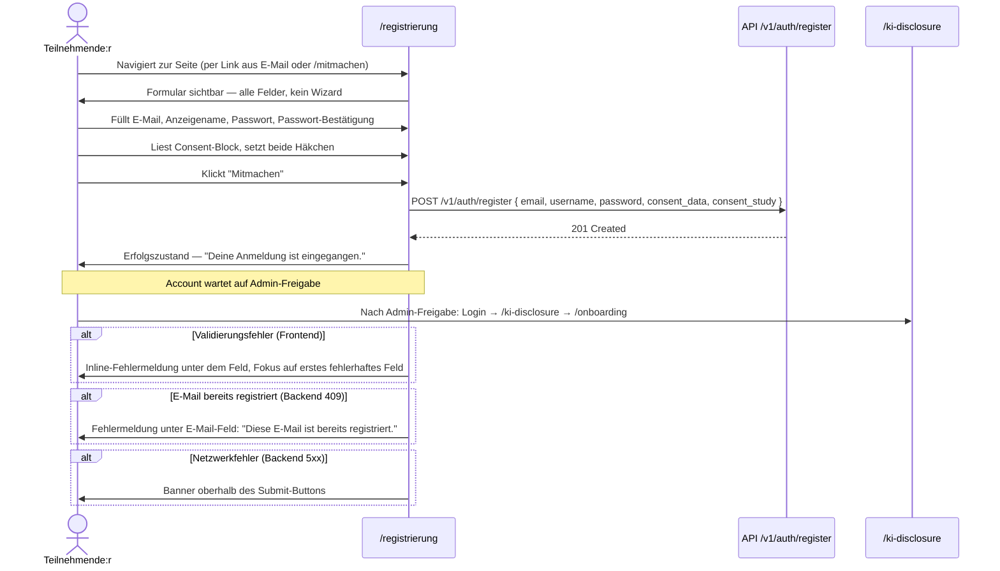

# UX-Design STORY-REG-001 — Registrierungsseite

**Erstellt:** 2026-07-03
**Designer:** ux-designer
**Übergabe an:** security
**Kontext:** Erster echter Kontakt zwischen Teilnehmenden und KAIA. Ersetzt den Countdown-Placeholder. Zielgruppe: bildungsaffine Erwachsene aus dem persönlichen Netzwerk der Forscherin, keine Tech-Nerds.

---

## 1. Konzept: "Du fängst hier an"

Kein Metapher-Overload. Kein "Dein Abenteuer beginnt". Kein Tagebuch-Intro.

Das Konzept ist reduzierter als das:

**Das Formular ist ein Gespräch — kein Ausfüllvorgang.**

KAIA stellt im Chat nur Fragen. Die Registrierung tut dasselbe. Jedes Feld hat eine kurze, persönlich formulierte Erklärung — nicht als Label-Suffix, sondern als kleinen Begleittext. Nicht "Benutzername *" sondern:

> "Wie soll KAIA dich ansprechen?"

Das ist die einzige konzeptionelle Besonderheit. Kein Staging, kein Reveal-Effekt, kein Schritt-für-Schritt-Wizard mit Fortschrittsbalken. Alle Felder auf einmal — weil ein Wizard für 5 Felder Overhead ist und die Zielgruppe keine Gamification braucht.

Die Besonderheit kommt aus dem Ton, nicht aus der Interaktionsmechanik.

---

## 2. User Flows



---

## 3. Visueller Aufbau

### Layout

Identische Hülle wie alle anderen Auth-Seiten: `AuthLayout` mit Header (KAIA-Link + ThemeToggle), zentrierter Content-Bereich, `LegalFooter`. Keine Abweichung vom bestehenden Shell.

Innerhalb des Content-Bereichs: `w-full max-w-md` — gleich wie Login und KI-Disclosure.

Kein zweispaltiges Layout, kein Sidebar-Konzept. Einspalt. Mobile-first.

### Stimmung

Das bestehende System ist bereits richtig: reduziert, monochrom, viel Luft. Die Registrierungsseite hält sich daran. Kein Farbakzent, keine Illustration, kein Icon-Overload.

Die Besonderheit ist **vertikaler Rhythmus**: Zwischen den Feldgruppen mehr Luft als üblich (`space-y-6` statt `space-y-4`), damit die Seite nicht wie ein Formular-PDF wirkt, sondern wie etwas zum Lesen.

### Besonderheit: Der Eröffnungstext

Direkt über dem ersten Feld — kein H1 mit "Registrierung", kein generischer Willkommenstext. Stattdessen ein kurzer, direkt adressierender Satz:

> "Schön, dass du dabei bist. Gleich kannst du loslegen."

Zwei Zeilen. `text-muted-foreground`, `text-sm`. Keine Überschrift — das wäre zu feierlich. Kein Marketing — das wäre unehrlich. Nur eine ruhige Bestätigung, dass die Person am richtigen Ort ist.

Davor steht als `h1` (sichtbar, nicht sr-only): **"Registrierung"** — in `text-2xl font-bold tracking-tight`, damit Screen Reader und Suchmaschinen einen klaren Ankerpunkt haben. Sichtbar, aber nicht dominant.

---

## 4. Feldstruktur und Einführung

Alle Felder auf einmal. Keine Animation beim Erscheinen. Kein Wizard.

Reihenfolge: E-Mail → Anzeigename → Passwort → Passwort-Bestätigung → Consent-Block → Submit.

### Feldaufbau (Schema pro Feld)

Jedes Feld besteht aus drei Teilen:

1. **Label** — sichtbar, klar, linked via `htmlFor`
2. **Begleittext** — ein Satz in `text-xs text-muted-foreground` direkt unter dem Label, vor dem Input. Erklärt Zweck, nicht Format.
3. **Input** — im bestehenden Stil (`rounded-lg border border-border bg-background px-4 py-3 text-sm focus:outline-none focus:ring-2 focus:ring-ring`)

Unter dem Input: Fehlermeldung (nur wenn fehlerhaft, `text-xs text-red-600 dark:text-red-400 mt-1`).

### Felder im Detail

**E-Mail-Adresse**
- Label: "E-Mail-Adresse"
- Begleittext: "An diese Adresse bekommst du deine Einladung zur Studie."
- Input: `type="email"` `autocomplete="email"` `inputmode="email"`
- Validierung: Pflichtfeld, E-Mail-Format

**Anzeigename**
- Label: "Wie soll KAIA dich ansprechen?"
- Begleittext: "Dein Vor- oder Spitzname — nur du und KAIA sehen ihn."
- Input: `type="text"` `autocomplete="username"` `maxLength={50}`
- Validierung: Pflichtfeld, 2–50 Zeichen, keine E-Mail-Adresse als Anzeigename
- Hinweis bei Eingabe von etwas das wie eine E-Mail aussieht: "Tipp: Kein vollständiger Name notwendig — ein Vorname oder Spitzname reicht."

**Passwort**
- Label: "Passwort"
- Begleittext: "Mindestens 8 Zeichen. Du musst es dir nicht merken — ein Passwort-Manager reicht."
- Input: `type="password"` `autocomplete="new-password"`
- Passwort-Sichtbarkeit-Toggle: Eye-Icon rechts im Input, `aria-label="Passwort anzeigen"` / `aria-label="Passwort verbergen"`, wechselt `type` zwischen `password` und `text`
- Validierung: Pflichtfeld, min. 8 Zeichen

**Passwort bestätigen**
- Label: "Passwort bestätigen"
- Begleittext: (keiner — das wäre Redundanz)
- Input: `type="password"` `autocomplete="new-password"`
- Passwort-Sichtbarkeit-Toggle: gleich wie oben
- Validierung: muss mit Passwort übereinstimmen, Vergleich erst beim Verlassen des Feldes (onBlur), nicht bei jedem Tastendruck

**Hinweis auf die Begleitnote unter "Passwort":** Der Satz "Du musst es dir nicht merken — ein Passwort-Manager reicht." ist bewusst entspannend. Die meisten Leute aus dem persönlichen Netzwerk werden unsichere Passwörter wählen, wenn sie unter Druck stehen. Dieser Satz reduziert Druck.

---

## 5. Consent-Block

Der Consent-Block ist kein Afterthought. Er ist ein eigenständiger Abschnitt mit klarer Abgrenzung nach oben (`border-t border-border pt-6 mt-2`).

### Warum kein Modal, kein Accordion

Consent muss lesbar sein — nicht versteckt hinter einem "Mehr anzeigen"-Toggle. Wenn der Text so lang ist, dass er versteckt werden muss, ist der Text zu lang.

### Aufbau

Überschrift: `text-sm font-semibold` — "Einwilligung"

Zwei Checkbox-Blöcke. Jeder Checkbox-Block besteht aus:
- `<input type="checkbox" />` linked via `id`/`htmlFor`
- Checkbox-Label in `text-sm font-medium` (der Satz den der User committet)
- Erklärungstext in `text-xs text-muted-foreground` mit Link auf Detailseite

**Checkbox 1 — Datenverarbeitung (Pflicht)**
- Checkbox-Label: "Ich stimme der Verarbeitung meiner Daten für die Lernbegleitung zu."
- Erklärungstext: "Deine Gespräche mit KAIA werden pseudonymisiert gespeichert. Du kannst deine Daten jederzeit löschen lassen. Details in der [Datenschutzerklärung →]."
- Link: `/datenschutz`, öffnet in neuem Tab (`target="_blank" rel="noopener noreferrer"`)

**Checkbox 2 — Studienteilnahme (Pflicht für Teilnahme)**
- Checkbox-Label: "Ich stimme der Nutzung meiner anonymisierten Daten für die Masterthesis-Studie zu."
- Erklärungstext: "Anonymisierte Ergebnisse fließen in eine wissenschaftliche Auswertung ein. Kein Rückschluss auf deine Person ist möglich. Du kannst die Teilnahme jederzeit beenden."
- Kein gesonderter Link — die Datenschutzerklärung deckt beides ab.

**Beide Checkboxen sind Pflicht.** Ohne beide ist Submit disabled. Der Submit-Button zeigt keinen Fehlerhinweis wenn Checkboxen nicht gesetzt — stattdessen zeigt er `aria-disabled="true"` und ist visuell gedimmt (`opacity-40`). Wenn jemand trotzdem versucht zu klicken, fokussiert der Browser auf die erste nicht gesetzte Checkbox (via JS).

Warum beide Pflicht: Die Studie ist der Zweck der App. Ohne Studien-Consent gibt es keinen Mehrwert für die Forscherin — und für die Teilnehmenden gibt es keinen Grund zum Mitmachen außer der Studie. Das muss transparent kommuniziert werden, nicht versteckt.

---

## 6. Submit-Button

**Button-Label:** "Mitmachen"

Nicht "Registrieren". Nicht "Konto erstellen". "Mitmachen" — weil das der eigentliche Akt ist. Die Person tritt einer Studie bei, nicht einer Plattform.

`w-full`, `bg-foreground text-background`, gleiche Klassen wie alle primären Buttons im System.

Darunter, `text-xs text-muted-foreground text-center`, zwei Zeilen:
> "Deine Anmeldung muss erst durch die Studienleitung freigegeben werden."
> "Du bekommst eine E-Mail, sobald dein Account aktiv ist."

Dieser Text steht vor dem Absenden, nicht nach. Er setzt die richtige Erwartung, bevor die Person klickt. Kein "Überraschung — du musst warten" nach dem Submit.

---

## 7. Screens / Zustände

### Erstaufruf (Normalzustand)

Alle Felder leer, Submit-Button disabled (weil Checkboxen nicht gesetzt). Kein Fehlertext, kein Hinweis — sauberer Ausgangszustand.

### Eingabe-Phase (während Ausfüllen)

- Fokussiertes Feld: `focus:ring-2 focus:ring-ring` — bestehende Token
- Ausgefüllte Felder: kein visuelles "grünes Häkchen" — das ist Gamification ohne Mehrwert und erzeugt Noise
- Ausnahme: das Passwort-Bestätigungs-Feld zeigt nach dem `onBlur`-Event einen `text-green-600 dark:text-green-400` Hinweis `"Stimmt überein."` wenn die Passwörter übereinstimmen. Begründung: bei diesem Feld ist das Feedback funktional notwendig, nicht dekorativ — der User kann den Typ "password" nicht sehen.

### Lade-/Streamingzustand

Nach Submit-Klick:
- Button wechselt zu `disabled`, zeigt `Loader2 animate-spin` Icon + Text: "Wird gespeichert…"
- Alle Felder werden `disabled`
- Kein Skeleton, kein Overlay — das Formular bleibt sichtbar

Keine Wartezeit-Schätzung nötig — der API-Call ist schnell (<1s erwartet).

### Erfolgszustand

Das Formular verschwindet. An seiner Stelle erscheint (im selben `max-w-md`-Container, kein Redirect):

```
[Icon: CheckCircle2, h-8 w-8, text-muted-foreground]

"Deine Anmeldung ist eingegangen."

[text-sm text-muted-foreground, max-w-sm mx-auto]
"Du bekommst eine E-Mail von Dagmar, sobald dein Account freigeschaltet ist.
Das dauert in der Regel ein bis zwei Tage."

[text-xs text-muted-foreground mt-6]
"Fragen? dagmar.rostek@wbstraining.de"
```

Kein Redirect zu Login — dort gibt es noch nichts für sie. Kein "Weiter zu /mitmachen" — das haben sie schon gelesen. Ruhe.

Der Erfolgstext nennt "Dagmar" beim Namen. Kein "die Studienleitung". Das ist ein persönliches Netzwerk — Distanz wäre falsch.

### Fehlerzustand (Validierung Frontend)

- Fehlermeldung erscheint direkt unter dem betroffenen Feld
- `role="alert"` auf dem Fehlertext damit Screen Reader es ankündigt
- Fokus springt nach Submit-Versuch automatisch auf das erste fehlerhafte Feld
- Fehlermeldungen in normaler Sprache (siehe Mikrotexte)

### Fehlerzustand (Backend 409 — E-Mail bereits vorhanden)

Fehlermeldung unter dem E-Mail-Feld:
> "Diese E-Mail ist bereits registriert. Hast du dich schon angemeldet? [Zur Anmeldung →]"

Link auf `/login`.

### Fehlerzustand (Backend 5xx — Netzwerkfehler)

Banner oberhalb des Submit-Buttons (nicht im Header, nicht als Toast):
```
[AlertCircle icon] "Technischer Fehler. Bitte versuche es in einem Moment erneut."
```
`rounded-lg bg-red-50 dark:bg-red-950/20 border border-red-200 dark:border-red-900 p-3 text-sm text-red-700 dark:text-red-400`

Das Formular bleibt editierbar. Felder nicht geleert.

### Leerzustand

Nicht anwendbar — das Formular ist selbst der Inhalt.

### Edge Cases

**Zurück-Button nach erfolgreichem Submit:** Wenn jemand zurück navigiert und nochmal submitted: das Backend gibt 409 zurück, die UI zeigt den E-Mail-Conflict-Hinweis. Korrekt — kein doppelter Account.

**Sehr langer Anzeigename:** `maxLength={50}` auf dem Input. Kein Zeichenzähler — bei 50 Zeichen ist ein Zähler Overhead. Der Browser-native Truncation greift im Label, KAIA kürzt intern bei der Anrede wenn nötig (BE-seitig).

**Paste von Passwort in Bestätigungsfeld:** Erlaubt. Das Verbot von Copy-Paste in Passwortfeldern ist ein Anti-Pattern (NIST SP 800-63B).

**Autofill:** `autocomplete`-Attribute korrekt gesetzt (siehe oben). Autofill soll funktionieren — die Felder werden nicht manipuliert um es zu verhindern.

---

## 8. Microinteraktionen

**Passwort-Toggle:** EyeOff → Eye beim Klick. Keine Animation, nur Icon-Wechsel. Der Input-Typ wechselt von `password` zu `text`. Aria-Label wechselt synchron.

**Checkbox-Fokus:** Wenn Submit geklickt wird obwohl Checkboxen nicht gesetzt, springt der Fokus auf die erste nicht gesetzte Checkbox. Ein kurzer `ring-2 ring-red-400` Fokusring für 1 Sekunde (`setTimeout` → Ring-Klasse entfernen), dann normaler Fokusring. Respektiert `prefers-reduced-motion` — bei reduced-motion: nur Fokus, kein Ring-Blink.

**Submit-Button — Aktivierungsmoment:** Der Button wechselt von `opacity-40 cursor-not-allowed` zu `opacity-100 cursor-pointer` in dem Moment, in dem beide Checkboxen gesetzt sind. Das ist der einzige visuelle State-Wechsel auf der Seite. Er ist bewusst so platziert: die Person bemerkt, dass sich etwas verändert hat, wenn sie die Einwilligung gibt. Das ist keine Manipulation — das ist transparentes Feedback.

**Passwort-Bestätigung — Übereinstimmungsindikator:** Erscheint `onBlur`, nicht `onChange`. Grüner Text "Stimmt überein." / roter Text mit Fehlermeldung wenn nicht. Der rote Text erscheint nur nach dem ersten `onBlur` — nicht während des Tippens.

---

## 9. AI-Vertrauensdesign

Die Registrierungsseite ist keine AI-Interaction — KAIA ist hier noch nicht aktiv. Trotzdem gelten Vertrauensprinzipien:

**Confidence-Darstellung:** Entfällt. Keine AI-generierte Ausgabe auf dieser Seite.

**Quellen / Erklärbarkeit:** Die Consent-Texte erklären konkret was mit den Daten passiert (pseudonymisiert, anonymisiert, Thesis) — keine vagen Phrasen wie "verbessert unsere Services".

**Korrektur-/Feedback-Wege:** Felder sind editierbar bis zum Submit. Nach erfolgreichem Submit: Datenkorrektur per E-Mail an Dagmar (Kontaktadresse im Erfolgsscreen sichtbar). Kein "Profil editieren"-Link in diesem Stadium — der Account ist noch nicht aktiv.

**Fallback bei Ausfall:** Wenn das Formular wegen Serverausfall nicht eingesendet werden kann, bleibt der Inhalt der Felder erhalten. Kein Silent-Fail. Die Fehlermeldung sagt explizit "Deine Eingaben sind noch da".

**KI-Disclosure:** KAIA ist keine KI auf dieser Seite — aber der Nutzer muss wissen, womit er sich registriert. Der Begleittext der Studien-Consent-Checkbox enthält den impliziten Hinweis ("Gespräche mit KAIA"). Die vollständige Disclosure findet nach der Admin-Freigabe auf `/ki-disclosure` statt. Das ist die richtige Reihenfolge: erst Fakten, dann Nutzung.

---

## 10. Accessibility-Check

- [ ] Kontrast >= 4.5:1 (Text): Alle Texte auf bg-background. `text-muted-foreground` (#737373 / #a3a3a3) — light mode 4.63:1, dark mode 6.35:1. Besteht AA. Fehlertexte `text-red-600` auf bg-background: 5.06:1. Besteht AA.
- [ ] Kontrast >= 3:1 (UI): Checkbox-Border auf bg-background, Input-Border auf bg-background — bestehende Token, im System bereits geprüft.
- [ ] Tastaturnavigation vollständig: Tab-Reihenfolge: E-Mail → Anzeigename → Passwort → [Eye-Toggle] → Passwort-Bestätigung → [Eye-Toggle] → Checkbox 1 → Checkbox 2 → Submit-Button. Keine Tab-Traps. Alle interaktiven Elemente erreichbar.
- [ ] Screen-Reader-Beschriftung (ARIA): Alle Labels via `htmlFor`/`id` verknüpft. Fehlermeldungen via `aria-describedby` auf dem Input referenziert. Submit-Button-Zustand via `aria-disabled`. Erfolgstext via `aria-live="polite"`. Siehe ARIA-Spec unten.
- [ ] Fokus-Indikatoren sichtbar: `focus:ring-2 focus:ring-ring` auf allen Inputs, Checkboxen und Buttons — bestehende Token.
- [ ] Sprache klar (Sprachniveau B1–B2): Alle Texte auf B1 gehalten. "Pseudonymisiert" wird in der Datenschutzerklärung erklärt, nicht hier — in der Consent-Zeile steht nur "Deine Gespräche werden gespeichert."
- [ ] Bewegung respektiert prefers-reduced-motion: Einzige Transition ist `opacity-Wechsel` auf dem Submit-Button und `Loader2 animate-spin`. Bei `prefers-reduced-motion: reduce` wird `animate-spin` durch statisches Icon ersetzt (Tailwind-Klasse `motion-reduce:animate-none`). Der Checkbox-Fokus-Ring-Blink entfällt.

### ARIA-Spec

```tsx
// Formular
<form aria-label="Registrierungsformular für die KAIA-Pilotstudie" noValidate>

// E-Mail
<label htmlFor="email">E-Mail-Adresse</label>
<p id="email-desc" className="text-xs text-muted-foreground">
  An diese Adresse bekommst du deine Einladung zur Studie.
</p>
<input
  id="email"
  type="email"
  aria-describedby="email-desc email-error"
  aria-invalid={!!errors.email}
  aria-required="true"
  autoComplete="email"
/>
<p id="email-error" role="alert" className="text-xs text-red-600">
  {errors.email}
</p>

// Anzeigename
<label htmlFor="username">Wie soll KAIA dich ansprechen?</label>
<p id="username-desc" className="text-xs text-muted-foreground">
  Dein Vor- oder Spitzname — nur du und KAIA sehen ihn.
</p>
<input
  id="username"
  type="text"
  aria-describedby="username-desc username-error"
  aria-invalid={!!errors.username}
  aria-required="true"
  autoComplete="username"
  maxLength={50}
/>

// Passwort
<label htmlFor="password">Passwort</label>
<p id="password-desc" className="text-xs text-muted-foreground">
  Mindestens 8 Zeichen.
</p>
<div className="relative">
  <input
    id="password"
    type={showPassword ? "text" : "password"}
    aria-describedby="password-desc password-error"
    aria-invalid={!!errors.password}
    aria-required="true"
    autoComplete="new-password"
  />
  <button
    type="button"
    aria-label={showPassword ? "Passwort verbergen" : "Passwort anzeigen"}
    aria-controls="password"
    onClick={() => setShowPassword(v => !v)}
  >
    {showPassword ? <EyeOff /> : <Eye />}
  </button>
</div>

// Passwort bestätigen
<label htmlFor="password_confirm">Passwort bestätigen</label>
<input
  id="password_confirm"
  type={showPasswordConfirm ? "text" : "password"}
  aria-describedby="password-confirm-error"
  aria-invalid={!!errors.passwordConfirm}
  aria-required="true"
  autoComplete="new-password"
/>
{/* Übereinstimmungsindikator — nur nach onBlur */}
<p aria-live="polite">
  {passwordMatch === true && "Stimmt überein."}
  {passwordMatch === false && "Passwörter stimmen nicht überein."}
</p>

// Consent-Checkboxen
<fieldset>
  <legend className="text-sm font-semibold">Einwilligung</legend>

  <div>
    <input
      id="consent_data"
      type="checkbox"
      aria-required="true"
      aria-describedby="consent-data-desc"
    />
    <label htmlFor="consent_data">
      Ich stimme der Verarbeitung meiner Daten für die Lernbegleitung zu.
    </label>
    <p id="consent-data-desc" className="text-xs text-muted-foreground">
      Deine Gespräche werden pseudonymisiert gespeichert. Du kannst deine Daten
      jederzeit löschen lassen. Details in der{" "}
      <a href="/datenschutz" target="_blank" rel="noopener noreferrer">
        Datenschutzerklärung
      </a>.
    </p>
  </div>

  <div>
    <input
      id="consent_study"
      type="checkbox"
      aria-required="true"
      aria-describedby="consent-study-desc"
    />
    <label htmlFor="consent_study">
      Ich stimme der Nutzung meiner anonymisierten Daten für die Masterthesis-Studie zu.
    </label>
    <p id="consent-study-desc" className="text-xs text-muted-foreground">
      Anonymisierte Ergebnisse fließen in eine wissenschaftliche Auswertung ein.
      Kein Rückschluss auf deine Person ist möglich. Du kannst die Teilnahme
      jederzeit beenden.
    </p>
  </div>
</fieldset>

// Submit
<button
  type="submit"
  aria-disabled={!consentData || !consentStudy || isLoading}
  disabled={!consentData || !consentStudy || isLoading}
>
  {isLoading ? (
    <>
      <Loader2 className="h-4 w-4 motion-reduce:animate-none animate-spin" aria-hidden />
      <span>Wird gespeichert…</span>
    </>
  ) : "Mitmachen"}
</button>

// Globaler API-Fehler
<div role="alert" aria-live="assertive">
  {apiError && <p>{apiError}</p>}
</div>

// Erfolgszustand
<div aria-live="polite" aria-atomic="true">
  {success && (
    <p>Deine Anmeldung ist eingegangen. Du bekommst eine E-Mail, sobald dein Account freigeschaltet ist.</p>
  )}
</div>
```

---

## 11. Compliance-UX

**Transparenzhinweise (EU AI Act Art. 50, DSGVO Art. 13/14):**

| Was | Wo | Wortlaut |
|---|---|---|
| AI-Natur von KAIA | Consent-Checkbox 2, Erklärungstext | "Gespräche mit KAIA" impliziert KI-Interaction; vollständige Disclosure auf /ki-disclosure nach Freigabe |
| Zweck der Datenverarbeitung | Consent-Checkbox 1 + 2 | explizit in den Erklärungstexten |
| Speicherdauer | Datenschutzerklärung (verlinkt) | nicht im Formular — zu viel für den Registrierungsmoment |
| Studienkontext | Consent-Checkbox 2 | "Masterthesis-Studie" ist benannt |
| Admin-Freigabe-Prozess | Unterhalb Submit-Button | vor dem Klick sichtbar |

**Einwilligungen:**

- Beide Checkboxen sind explizite, granulare Einwilligungen (DSGVO Art. 7)
- Keine Dark Patterns: keine vorausgefüllten Checkboxen, kein Double Negation ("Ich möchte keine E-Mails erhalten, um keine Angebote zu verpassen")
- Widerruf: in Datenschutzerklärung erklärt; nach Admin-Freigabe in Nutzer-Einstellungen (noch nicht gebaut)
- Consent wird mit Timestamp und IP-Hash gespeichert (Backend-Pflicht — außerhalb dieses UX-Docs)
- Beide Checkboxen single-purpose: Checkbox 1 = Betrieb, Checkbox 2 = Studie. Nicht zusammengefasst, weil Art. 7 Abs. 2 DSGVO Granularität erfordert

**Datenrechte-Pfade:**
- Datenlöschung: via Datenschutzerklärung → Kontaktformular (bestehender Pfad)
- Auskunft (Art. 15): nach Freigabe in Nutzerbereich (noch nicht gebaut)
- Consent-Widerruf: nach Freigabe in Nutzerbereich oder per E-Mail an Dagmar

**Schrems-II / Drittland-Transfers:** LLM-Provider (Anthropic/OpenAI/Mistral) verarbeiten Prompts. Das ist in der Datenschutzerklärung abzudecken — nicht im Registrierungsformular. Kein Hinweis auf der Registrierungsseite, aber der Link zur Datenschutzerklärung ist vorhanden.

---

## 12. Mikrotexte — vollständige Liste

| Element | Text | Anmerkung |
|---|---|---|
| Page Title (meta) | "Registrierung — KAIA" | |
| h1 | "Registrierung" | Sichtbar, nicht nur sr-only |
| Eröffnungstext | "Schön, dass du dabei bist. Gleich kannst du loslegen." | text-sm text-muted-foreground, unter h1 |
| Label E-Mail | "E-Mail-Adresse" | |
| Begleittext E-Mail | "An diese Adresse bekommst du deine Einladung zur Studie." | text-xs text-muted-foreground |
| Label Anzeigename | "Wie soll KAIA dich ansprechen?" | Kein "Benutzername" |
| Begleittext Anzeigename | "Dein Vor- oder Spitzname — nur du und KAIA sehen ihn." | text-xs text-muted-foreground |
| Label Passwort | "Passwort" | |
| Begleittext Passwort | "Mindestens 8 Zeichen. Du musst es dir nicht merken — ein Passwort-Manager reicht." | Entspannend formuliert |
| Toggle Passwort anzeigen | aria-label: "Passwort anzeigen" | Kein sichtbarer Text |
| Toggle Passwort verbergen | aria-label: "Passwort verbergen" | Kein sichtbarer Text |
| Label Passwort bestätigen | "Passwort bestätigen" | |
| Passwort-Match OK | "Stimmt überein." | text-xs text-green-600, nach onBlur |
| Consent-Fieldset-Legend | "Einwilligung" | |
| Checkbox-Label 1 | "Ich stimme der Verarbeitung meiner Daten für die Lernbegleitung zu." | |
| Erklärungstext Checkbox 1 | "Deine Gespräche werden pseudonymisiert gespeichert. Du kannst deine Daten jederzeit löschen lassen. Details in der Datenschutzerklärung →." | Link auf /datenschutz |
| Checkbox-Label 2 | "Ich stimme der Nutzung meiner anonymisierten Daten für die Masterthesis-Studie zu." | |
| Erklärungstext Checkbox 2 | "Anonymisierte Ergebnisse fließen in eine wissenschaftliche Auswertung ein. Kein Rückschluss auf deine Person ist möglich. Du kannst die Teilnahme jederzeit beenden." | |
| Submit-Button | "Mitmachen" | Nicht "Registrieren" |
| Submit-Button (Laden) | "Wird gespeichert…" | mit Loader2 Icon |
| Erwartungstext unter Button | "Deine Anmeldung muss erst durch die Studienleitung freigegeben werden." | text-xs text-muted-foreground |
| Erwartungstext unter Button (Zeile 2) | "Du bekommst eine E-Mail, sobald dein Account aktiv ist." | text-xs text-muted-foreground |
| Erfolgstitel | "Deine Anmeldung ist eingegangen." | kein "Herzlich willkommen!" |
| Erfolgstext | "Du bekommst eine E-Mail von Dagmar, sobald dein Account freigeschaltet ist. Das dauert in der Regel ein bis zwei Tage." | Persönlich, realistisch |
| Kontakt im Erfolgsscreen | "Fragen? dagmar.rostek@wbstraining.de" | text-xs text-muted-foreground |
| Fehler: E-Mail-Format | "Bitte gib eine gültige E-Mail-Adresse ein." | |
| Fehler: E-Mail Pflichtfeld | "E-Mail-Adresse ist erforderlich." | |
| Fehler: E-Mail bereits vergeben | "Diese E-Mail ist bereits registriert. Hast du dich schon angemeldet? Zur Anmeldung →" | Link auf /login |
| Fehler: Anzeigename Pflichtfeld | "Bitte gib an, wie KAIA dich ansprechen soll." | |
| Fehler: Anzeigename zu kurz | "Mindestens 2 Zeichen bitte." | |
| Fehler: Passwort Pflichtfeld | "Passwort ist erforderlich." | |
| Fehler: Passwort zu kurz | "Mindestens 8 Zeichen." | |
| Fehler: Passwörter stimmen nicht überein | "Passwörter stimmen nicht überein." | Erscheint nach onBlur |
| Fehler: Consent nicht gesetzt | Kein Text — Fokus springt zur ersten offenen Checkbox | Kein Fehlertext, nur visueller Fokus |
| Fehler: Netzwerkfehler (Banner) | "Technischer Fehler. Bitte versuche es in einem Moment erneut. Deine Eingaben sind noch da." | role="alert", Banner-Stil |
| Link "Bereits registriert?" | "Bereits registriert? Anmelden →" | text-sm text-muted-foreground, unter Submit-Button |

---

## 13. Was NICHT eingebaut wird — und warum

**Schritt-für-Schritt-Wizard:** Fünf Felder sind kein Grund für einen Wizard. Wizards erzeugen Overhead (Zurück-Button, Zustandsverwaltung, State-Loss bei Reload) und vermitteln dem User das Gefühl, auf einer langen Reise zu sein. Hier ist die Reise kurz.

**Fortschrittsanzeige / "Fast geschafft!":** Verleitet zu Geschwindigkeit statt Aufmerksamkeit. Die Consent-Checkboxen müssen gelesen werden — kein Fortschrittsbalken der suggeriert "beeil dich".

**Passwort-Stärke-Meter:** Lenkt von der eigentlichen Mindestanforderung ab und gibt falsches Sicherheitsgefühl. "Mindestens 8 Zeichen" ist die Anforderung. Mehr braucht es nicht.

**Social Login (Google, GitHub):** Nicht in der Architektur — und für eine geschlossene Pilotstudie sinnlos. Admin muss Accounts manuell freischalten; OAuth würde diesen Prozess verkomplizieren.

**Inline-Vorschau des Anzeigenamens:** "Hallo, [Name]!" Live-Preview beim Tippen klingt nett, ist aber Gamification. Setzt falsche Erwartungen über das Nutzungserlebnis.

**Pflichtfelder mit Sternchen:** Standard-Muster, das hier nicht nötig ist — alle Felder sind Pflichtfelder. Wenn alle Felder einen Stern haben, haben Sterne keine Information.

---

*Übergabe an: security — Threat Model für POST /v1/auth/register: Credential-Stuffing, Account-Enumeration via E-Mail-Conflict-Antwort, CSRF, Consent-Replay-Angriffe.*
