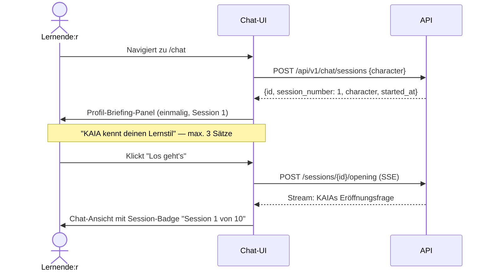
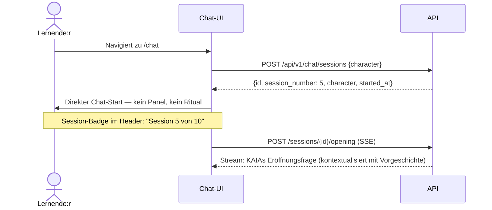
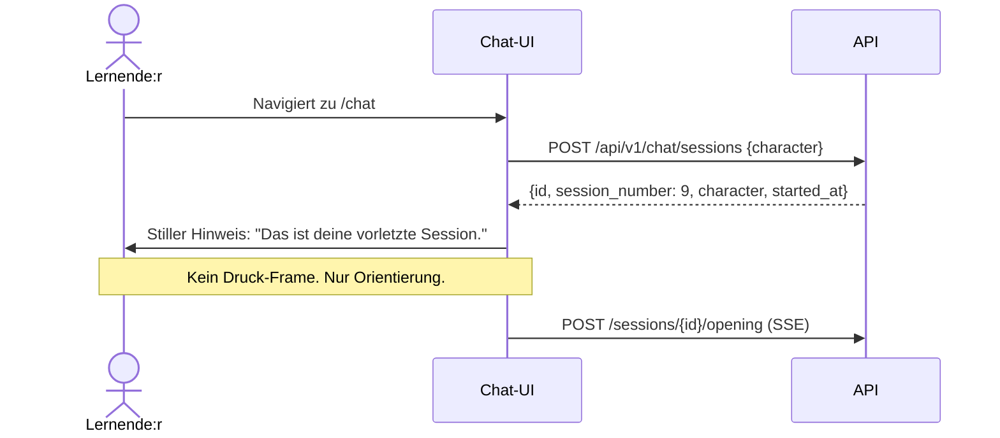

# UX-Design STORY-SESSION-PROGRESS — Session-Fortschrittsanzeige & Profil-Transparenz

**Erstellt:** 2026-07-04
**Designer:** ux-designer
**Übergabe an:** security
**Kontext:** 10-Session-Journey-UX. Zwei Wünsche: Session-Fortschrittsanzeige ("Session X von 10") und Entscheidung, was Nutzer:innen vom psychometrischen Profil (MSLQ + GSE) sehen sollen.

---

## 1. Ausgangslage und kritische Vorab-Einschätzung

Der Code-Review der `chat/page.tsx` zeigt: Das Frontend empfängt `session_number` aus der `SessionResponse` (Backend-Schema vorhanden, `session_number: int`). Der Wert wird aktuell verworfen — `const { id: sid } = await sessRes.json()` destrukturiert nur `id`. Das ist der zentrale Ausgangspunkt.

**Kritische Beobachtung:** Die Frage "Was sieht der Nutzer vom Profil?" ist keine reine UX-Frage. Sie berührt DSGVO Art. 13 (Informationspflichten), das Psychologen-Prinzip "keine Etikettierung", und EU AI Act Art. 50 (Transparenz). Ich beantworte sie aus UX-Sicht vollständig — aber die psychologist-Freigabe für Sprachregelungen und die compliance-Freigabe für die Datenschutzdarstellung sind Pflichtschritte vor Implementierung.

---

## 2. User Flows

### Flow A — Session starten (Session 1, erstes Mal)



### Flow B — Session starten (Session 3–9, Folgesession)



### Flow C — Letzte Sessions (Session 9 und 10)



---

## 3. Frage 1 — Session-Progress-UI

### 3.1 Platzierung: Header, als Badge

**Empfehlung: Im Header, direkt neben dem KAIA-Schriftzug. Kein separater Bereich.**

Begründung:
- Der Header ist der einzige persistente Element auf der Seite — er scrollt nicht weg.
- Das Feedback-Band und der Input sind funktional. Der Header ist Orientierung. Orientierung gehört in die Orientierungszone.
- Ein Badge oben im Chat-Bereich würde beim Scrollen verschwinden und so die Orientierungsfunktion verlieren.
- Ein Badge unterhalb der Nachrichten würde erst nach Laden der ersten KAIA-Nachricht erscheinen — das ist zu spät.

**Konkrete Position:** Zwischen dem KAIA-Label und der technischen Session-ID (`#sessionId`). Die Session-ID ist für Nutzer:innen irrelevant — sie kann auf `sr-only` oder in einen Dev-only-Kontext verschoben werden.

**Visuelles Konzept:**

```
┌─────────────────────────────────────────────────────────────────────────┐
│ KAIA   Session 5 von 10                   🌸 Warm  ⚡  🎭  [+] [Beenden] │
└─────────────────────────────────────────────────────────────────────────┘
```

"Session 5 von 10" — keine umrandete Pill, kein farbiger Badge. Einfacher `text-xs text-muted-foreground`-Text. Gleiche typografische Ebene wie `#sessionId` jetzt.

**Warum kein farbiger Badge, kein Fortschrittsbalken:**
- Ein Fortschrittsbalken visuell kommuniziert "du bist noch nicht fertig" — das ist Druck.
- Eine grüne/orange/rote Farbkodierung ("schon Session 9!") aktiviert Gamification-Mechanismen.
- Die Forschung zu Zielerreichungsframing zeigt: die Nähe zum Ziel erhöht Motivation UND Stress. In einem empathischen Lernkontext ist Stress-Reduktion das Designziel.

### 3.2 Was zusätzlich anzeigen? Phasen vs. Nummern

**Empfehlung: Nur die Nummer. Keine Phasenbezeichnungen.**

Die ursprüngliche Idee "Aufbau / Vertiefung / Abschluss" klingt pädagogisch sinnvoll. Das Problem:

1. **Erwartungsrahmung:** Wenn Session 1–3 "Aufbau" heißen, impliziert das, dass Session 1 noch "weniger zählt". Das ist falsch und pädagogisch kontraproduktiv.
2. **Vorwegnahme der Erfahrung:** "Heute: Abschluss" sagt dem Lernenden, was er fühlen soll, bevor er mit KAIA gesprochen hat. Das widerspricht der sokratischen Logik.
3. **Statik vs. Adaptivität:** KAIA passt sich an — eine vorgegebene Phasenbezeichnung tut das nicht. Sie schafft einen Widerspruch zwischen Versprechen und Realität.

Wenn die Studienarchitektur tatsächlich definierte Phasen kennt (und der `psychologist` und `didaktiker` diese freigegeben haben), dann kann eine Phasenangabe ergänzt werden — aber als dezenter Tooltip-Text, nicht als primäre UI-Aussage.

### 3.3 Wie wird Stress verhindert?

**Das Stressrisiko sitzt nicht bei Session 5. Es sitzt bei Session 8, 9, 10.**

Zwei Anti-Stress-Designentscheidungen:

**Entscheidung 1 — Kein Countdown-Framing.**
"Session 8 von 10" — nicht "Noch 2 Sessions". Das ist ein präziser sprachlicher Unterschied. "Von 10" ist Orientierung. "Noch 2" ist Druck.

**Entscheidung 2 — Kein stilistischer Unterschied zwischen Sessions.**
Session 9 sieht aus wie Session 2. Kein fetterer Schriftzug, keine andere Farbe, kein "Fast geschafft!"-Moment. Der einzige Unterschied ist eine stille Textzeile, die nur bei Session 9 und 10 erscheint (s.u.).

**Stille Kontextualisierung für Session 9 und 10:**

Direkt nach dem Session-Start, vor KAIAs Eröffnung, erscheint **ein einziger Satz** in kleiner muted-Schrift, zentriert im Chat-Bereich, als nicht-klickbares System-Element (kein Button, kein Icon):

- Session 9: "Das ist deine vorletzte Session."
- Session 10: "Das ist deine letzte Session."

Dieser Satz ist informativ, nicht emotional. Er stellt keine Frage, er gibt keinen Ratschlag, er erzeugt keinen Call-to-Action. Er hilft dem Lernenden, sich zeitlich zu orientieren — das ist alles.

Dieser Satz erscheint **nicht** wenn die Session schon gestartet wurde und der Nutzer die Seite neu lädt (d.h. er ist abhängig von `messages.length === 0` zu dem Zeitpunkt). Er ist ein Einstiegselement, kein persistentes Label.

---

## 4. Frage 2 — Profil-Transparenz: Was sieht der Nutzer?

### 4.1 Klare Empfehlung: Option C mit einem spezifischen Unterschied

Weder Option A (nichts) noch Option B (vollständige stille Nutzung) sind vertretbar. Option C (explizite Profilanzeige vor Session 1) ist richtig — aber nicht als Bestätigungsschritt, sondern als **einmaliges Briefing-Panel**.

**Warum Option A (nichts zeigen) nicht geht:**

- DSGVO Art. 13 Abs. 2 lit. f: Wenn ein automatisiertes System Informationen über eine Person verarbeitet um ihr Verhalten zu beeinflussen, muss dies transparent gemacht werden. Dass KAIA ein psychometrisches Profil nutzt, um den Gesprächsstil anzupassen, ist eine Form automatisierter Verarbeitung.
- EU AI Act Art. 50: Die Nutzung eines Nutzerprofils zur Anpassung von AI-Outputs muss für den Nutzer erkennbar sein.
- UX-Vertrauen: Wenn Nutzer:innen später merken, dass KAIA "irgendwie auf sie abgestimmt" war, ohne dass sie das wussten, entsteht ein Uncanny-Valley-Effekt. "Woher weiß die KI das?" erzeugt Unbehagen, nicht Vertrauen.

**Warum Option B (Zusammenfassung "KAIA weiß: du lernst am besten durch X") nicht geht:**

- Das verstößt gegen die psychologist-Sprachregelung: Keine Etikettierung, kein Typ, keine Prognose.
- "Du lernst am besten durch X" ist eine Aussage über Kausalität, die aus Fragebogendaten nicht ableitbar ist.
- Es erzeugt eine Self-Fulfilling-Prophecy: Der Lernende verhält sich so, wie das Profil ihn beschreibt, weil er es gelesen hat.

### 4.2 Das Briefing-Panel (Session 1, einmalig)

**Wann:** Nach Session-Start (POST /sessions liefert `session_number: 1`), vor dem ersten SSE-Opening-Stream.

**Aussehen:** Kein Modal. Ein Inline-Panel, das den Chat-Bereich ersetzt. Volle Breite, max-w-2xl, zentriert — konsistent mit dem Chat-Layout.

**Inhalt:**

```
┌─────────────────────────────────────────────────────────────────────────┐
│                                                                         │
│   KAIA kennt deinen Ausgangspunkt                                       │
│   ──────────────────────────────                                        │
│                                                                         │
│   Aus deinen Antworten im Fragebogen hat KAIA ein Bild davon,          │
│   wie du aktuell an Lernthemen herangehst. Dieses Bild fließt         │
│   in die Fragen ein, die KAIA dir stellt.                              │
│                                                                         │
│   KAIA macht keine Aussagen darüber, wie du "als Person" bist.         │
│   Es geht darum, wie du dich gerade beschreibst — und darum,           │
│   von dort aus weiterzudenken.                                          │
│                                                                         │
│   [  Los geht's  ]                                                      │
│                                                                         │
│   Was fließt ein? (aufklappbar, standardmäßig zugeklappt)              │
│                                                                         │
└─────────────────────────────────────────────────────────────────────────┘
```

**Warum kein Bestätigungsschritt (Checkbox):** Die Einwilligung zur Verarbeitung wurde bereits im Multi-Step-Consent vor Onboarding erteilt. Hier geht es nicht um eine neue Einwilligung — es geht um Transparenz. Eine weitere Checkbox wäre Consent-Fatigue.

**Der aufklappbare Bereich "Was fließt ein?":**

```
Was fließt in KAIAs Fragen ein?
─────────────────────────────────
- Wie du Lernstrategien beschrieben hast (Fragebogen, Woche 0)
- Dein Ausgangswert auf der Selbstwirksamkeitsskala
- Diese Informationen werden nicht an Dritte weitergegeben.
- Sie werden gespeichert bis zum Ende der Studie.

→ Zur vollständigen Datenschutzerklärung
```

Dieser Bereich ist technisch korrekt und rechtlich vollständig — aber er steht nicht im Vordergrund, weil er für die meisten Nutzer:innen nicht der primäre Informationsbedarf ist. Wer es wissen will, findet es. Wer es nicht braucht, wird nicht damit belastet.

### 4.3 Was KAIA nicht anzeigen darf

Das ist ein Pflichtabschnitt, weil diese Fehler naheliegend wären:

| Nicht zeigen | Warum |
|---|---|
| "Dein Selbstwirksamkeitswert: 28 von 40" | Punktwerte ohne Interpretation sind irreführend und verstoßen gegen Psychometrik-Sprachregeln |
| "Du bist ein selbstgesteuerter Lerntyp" | Typologisierung, wissenschaftlich nicht gedeckt, Etikettierungsverbot |
| "Deine Stärke: Metakognition" | Prognostische Überdehnung aus Fragebogendaten |
| "KAIA empfiehlt dir: Strategie X" | Empfehlung ohne nachgewiesene Kausalität |
| Balkendiagramme, Radar-Charts, Scores | Zahlen wirken objektiver als sie sind — Anti-Automation-Bias-Design verbietet das |

Die Sprachregelungen aus dem `psychologist`-Agenten gelten hier vollständig. Die endgültige Formulierung des Briefing-Panels muss durch den Psychologen freigegeben werden.

---

## 5. Frage 3 — Session-Start-Ritual: Was passiert bei Session 3 vs. Session 8?

### 5.1 Klare Empfehlung: Kein separates Ritual

**Die Session beginnt mit KAIAs Eröffnungsfrage. Das ist das Ritual.**

Ein separates "Was letztes Mal war"-Panel vor der Eröffnung würde:
1. Den sokratischen Einstieg verzögern
2. Eine Erwartung setzen, die KAIA vielleicht gerade nicht erfüllt
3. Den Nutzer in eine retrospektive Haltung versetzen, bevor der Lernfluss beginnt

**Was KAIA stattdessen tut:** Die Eröffnungsfrage der Folgesession ist durch das Cross-Session-Memory bereits kontextualisiert. Der `service.py`-Code zeigt `load_cross_session_context` — KAIA weiß, was vorher war. Diese Kontextualisierung soll sich in KAIAs Eröffnungsfrage zeigen, nicht in einem UI-Panel.

**Das ist eine Aufgabe für den `ai-engineer`-Agenten, nicht für das Frontend.**

### 5.2 Differenzierung Session 1 vs. Folgesessions

| Session | Frontend-Verhalten |
|---|---|
| Session 1 | Briefing-Panel (einmalig), dann Opening-Stream |
| Session 2–8 | Direkter Opening-Stream. Session-Badge im Header. |
| Session 9 | Direkter Opening-Stream. Stiller Hinweis "Das ist deine vorletzte Session." |
| Session 10 | Direkter Opening-Stream. Stiller Hinweis "Das ist deine letzte Session." |

### 5.3 Was nicht gebaut wird

**Kein "Letztes Mal hatten wir..."-Panel.** Aus drei Gründen:

1. KAIAs Cross-Session-Memory übernimmt diese Funktion — aber besser, weil es kontextsensitiv ist.
2. Eine statische Zusammenfassung der letzten Session erzeugt eine Erwartung, die der aktuelle Kontext vielleicht nicht einlöst.
3. Jede Session soll als offener Einstieg erlebt werden, nicht als Fortsetzung eines Skripts.

**Kein Session-Ziel vorab definieren.** Die Frage "Was möchtest du heute lernen?" vor jeder Session klingt hilfreich, ist aber eine Instruktionsvorgabe, die dem sokratischen Prinzip widerspricht. KAIA stellt die Fragen. Nicht die UI.

---

## 6. Code-Analyse: Einbaupfad und Fallstricke

### 6.1 Was bereits vorhanden ist

`SessionResponse` im Backend-Schema enthält bereits `session_number: int` (Zeile 23 in `schemas.py`). Die API liefert den Wert. Das Frontend verwirft ihn.

**Aktuell in `chat/page.tsx` (Zeile 145):**
```typescript
const { id: sid } = await sessRes.json() as { id: number }
```

Das `as { id: number }` ignoriert `session_number`. Das ist der einzige notwendige Eingriff auf Daten-Ebene.

### 6.2 Minimaler Eingriff für Session-Badge

**State hinzufügen:** Ein `useState<number | null>(null)` für `sessionNumber`.

**Destrukturierung erweitern:**
```typescript
const { id: sid, session_number } = await sessRes.json() as { id: number; session_number: number }
setSessionId(sid)
setSessionNumber(session_number)
```

Das ist eine chirurgische Änderung: zwei neue Zeilen, eine neue State-Variable. Kein Refactoring.

**Header-Badge einfügen:**
Zwischen `<span className="font-semibold tracking-tight">KAIA</span>` und der Session-ID-Span eine neue Span:
```tsx
{sessionNumber && (
  <span className="text-xs text-muted-foreground" aria-label={`Session ${sessionNumber} von 10`}>
    Session {sessionNumber} von 10
  </span>
)}
```

**Stiller Hinweis bei Session 9/10:**
Vor dem ersten `messages.map`-Block, als Bedingung `sessionNumber >= 9 && messages.length === 0`:
```tsx
{sessionNumber !== null && sessionNumber >= 9 && messages.length === 0 && (
  <p className="text-center text-xs text-muted-foreground/60 py-2" aria-live="polite">
    {sessionNumber === 10 ? "Das ist deine letzte Session." : "Das ist deine vorletzte Session."}
  </p>
)}
```

### 6.3 Fallstricke

**Fallstrick 1 — Reset-Logik:** `resetSession()` setzt `sessionId` zurück, aber nicht `sessionNumber`. Bei einem Reset würde der Badge den alten Wert zeigen bis die neue Session-API-Antwort kommt. Lösung: `setSessionNumber(null)` in `resetSession()`.

**Fallstrick 2 — Race Condition beim Opening-Stream:** Das Opening-SSE beginnt direkt nach dem Session-POST. In seltenen Fällen (langsames Netz) könnte `sessionNumber` noch null sein wenn die erste KAIA-Nachricht erscheint. Das ist unkritisch — der Badge erscheint dann etwas später. Kein Fehlerfall.

**Fallstrick 3 — Hardcoded "10":** Die `10` in "Session X von 10" ist ein Hardcode. Wenn die Studie 12 Sessions hätte, wäre das falsch. Saubere Lösung: Die maximale Session-Zahl vom Backend mitliefern (`max_sessions: int` in `SessionResponse`) oder als Konstante in einer Config-Datei definieren. Für den aktuellen Studienkontext ist ein Hardcode vertretbar — aber dokumentieren.

**Fallstrick 4 — Briefing-Panel und Opening-Race:** Das Briefing-Panel (Session 1) muss erscheinen, bevor der Opening-SSE-Stream beginnt. Der aktuelle Code startet den Opening-Stream direkt nach dem Session-POST. Der Stream-Start muss also darauf warten, dass der Nutzer "Los geht's" geklickt hat. Das erfordert eine kleine Zustandserweiterung: `const [briefingDone, setBriefingDone] = useState(false)` — und die Opening-Fetch-Logik wird nur ausgeführt wenn `briefingDone === true` oder `sessionNumber !== 1`.

**Fallstrick 5 — Komplexität der Datei:** Die `chat/page.tsx` hat 608 Zeilen und einen komplexen State-Automaten (closureState, closureExchanges, Timer, SSE-Streams). Vor jedem Eingriff muss die gesamte State-Maschine verstanden sein. Jede neue State-Variable ist potenzieller Konflikt mit der bestehenden Logik. Die Empfehlung an den Implementierer: Änderungen in kleinen, separat testbaren Schritten. Nicht alles auf einmal.

**Fallstrick 6 — Briefing-Panel und `openTrigger`:** Der aktuelle Code startet den Session-Flow via `useEffect(..., [openTrigger, character])`. Das Briefing-Panel-Konzept erfordert, dass der Opening-Stream nicht automatisch beim Mounten startet, sondern erst nach User-Interaktion. Das ist eine nicht-triviale Änderung am Flow-Einstiegspunkt. Der Architect sollte das vor Implementierung bewerten.

### 6.4 Gesamtaufwand-Einschätzung

| Komponente | Aufwand | Risiko |
|---|---|---|
| Session-Badge im Header | < 30 Minuten | Niedrig — rein additiv |
| Stiller Hinweis Session 9/10 | < 15 Minuten | Niedrig — rein additiv |
| Reset-Bugfix (sessionNumber) | 5 Minuten | Niedrig |
| Briefing-Panel Session 1 | 2–3 Stunden | Mittel — erfordert Flow-Änderung |
| Profil-Daten vom Backend | Requires architect + ai-engineer | Abhängigkeit — nicht rein Frontend |

---

## 7. Screens / Zustände

### Session-Badge (alle Sessions)

**Erstaufruf:** Badge erscheint sobald die Session-POST-Response verarbeitet wurde. Bis dahin: kein Platzhalter, kein Skeleton — der Header ist komplett.

**Lade-/Streamingzustand:** Badge bleibt stabil. Er ändert sich nicht während des SSE-Streams.

**Erfolgszustand:** `"Session 5 von 10"` — statischer Text, keine Animation.

**Fehlerzustand:** Wenn Session-POST fehlschlägt, ist `sessionNumber` null — Badge wird nicht gerendert. Das ist korrekt.

**Leerzustand:** Vor Session-POST: kein Badge. Das ist akzeptabel — der Header lädt schnell.

**Edge Case — Session 10 bereits abgeschlossen:** Die Studie-Abschluss-Logik ist bereits in Routes implementiert (403 + `study_completed`). Der Badge-Zustand ist in diesem Pfad irrelevant.

### Briefing-Panel (Session 1 only)

**Erstaufruf:** Panel erscheint statt des Chats. Der Header ist vollständig sichtbar (inkl. Badge "Session 1 von 10").

**Lade-/Streamingzustand:** Kein Streaming-Zustand — das Panel ist statischer Content.

**Erfolgszustand:** Nutzer klickt "Los geht's" → Panel verschwindet → Opening-Stream beginnt → Chat-Ansicht erscheint.

**Fehlerzustand:** Wenn Opening-Stream fehlschlägt, gelten die bestehenden Fehler-Darstellungen aus dem Chat.

**Edge Case — Nutzer:in lädt Seite neu in Session 1:** Session ist bereits erstellt (sessionId vorhanden), aber das Frontend weiß nicht, ob das Panel schon gesehen wurde. Lösung: `sessionStorage.setItem("kaia_briefing_shown", "true")` nach Klick auf "Los geht's". Bei Reload: wenn Wert gesetzt, direkt in den Chat. Das verhindert, dass das Panel bei jedem Page-Reload erscheint.

---

## 8. AI-Vertrauensdesign

**Confidence-Darstellung:** Entfällt für Session-Progress (keine AI-Confidence-Aussage). Für das Briefing-Panel: Die Formulierung "KAIA hat ein Bild davon, wie du aktuell an Lernthemen herangehst" ist bewusst unscharf — kein Konfidenzwert, keine Präzision die nicht gerechtfertigt ist.

**Quellen / Erklärbarkeit:** Der aufklappbare Bereich "Was fließt ein?" beantwortet die Frage auf Nutzer-Niveau. Kein technisches Detail, keine Algorithmusbeschreibung. Die Antwort lautet: "Deine Fragebogen-Antworten."

**Korrektur-/Feedback-Wege:** Nutzer:innen können das Profil nicht korrigieren — das wäre wissenschaftlich problematisch (die Prä-Messung würde verändert). Es gibt jedoch einen Weg zur Datenschutzseite, auf der Auskunft und Löschung erklärt werden. Das ist der korrekte Weg.

**Fallback bei Ausfall:** Wenn die Profildaten nicht verfügbar sind (Backend-Fehler), wird das Briefing-Panel mit dem Standardtext gerendert. KAIA greift dann auf keinen Profil-Kontext zurück — das sollte im Opening-Prompt gehandelt werden (Fallback-Verhalten ist Aufgabe des ai-engineer).

---

## 9. Accessibility-Check

- [ ] Kontrast >= 4.5:1 (Text): `text-muted-foreground` auf `bg-background` — im bestehenden Token-System geprüft (bestehende UX-Specs: 4.63:1 in Light, 6.35:1 in Dark). Session-Badge nutzt dieselbe Klasse.
- [ ] Kontrast >= 3:1 (UI): "Los geht's"-Button nutzt `bg-foreground text-background` — maximaler Kontrast.
- [ ] Tastaturnavigation vollständig: Briefing-Panel: Tab auf "Los geht's" direkt nach Render (kein anderes interaktives Element). Aufklappbarer Bereich: `<details>/<summary>` oder ARIA-Expand-Pattern — Tab-navigierbar.
- [ ] Screen-Reader-Beschriftung (ARIA): Session-Badge: `aria-label="Session 5 von 10"` auf dem Span (der Text allein reicht eigentlich, aber das Label stellt sicher, dass "von 10" nicht als Bruch gelesen wird). Briefing-Panel: `<section aria-label="Einführung: KAIA kennt deinen Ausgangspunkt">`. Aufklappbarer Bereich: `aria-expanded` korrekt gesetzt.
- [ ] Fokus-Indikatoren sichtbar: Konsistent mit bestehendem System. "Los geht's"-Button: `focus:ring-2 focus:ring-foreground/20`.
- [ ] Sprache klar (Sprachniveau B1–B2): Alle Texte auf B1 gehalten. "Selbstwirksamkeitsskala" wird nicht im UI verwendet — das ist Fachsprache, die in der Datenschutzerklärung stehen kann, nicht im Briefing.
- [ ] Bewegung respektiert prefers-reduced-motion: Das Briefing-Panel hat keine eigene Animation. Der Übergang vom Panel zum Chat (wenn "Los geht's" geklickt wird) ist ein DOM-Austausch ohne Transition. Kein Fade, kein Slide.

---

## 10. Compliance-UX

**Transparenzhinweise:**
- Briefing-Panel: Erklärt, dass Fragebogendaten in KAIAs Fragestellung einfließen. Ort: direkt vor Session 1, nicht im Footer, nicht in der Datenschutzerklärung allein.
- Aufklappbarer Bereich "Was fließt ein?": Nennt konkret GSE + MSLQ-Fragebogen als Datenquellen. Link zur Datenschutzerklärung.

**Einwilligungen:**
- Die Einwilligung zur Profilnutzung wurde im Multi-Step-Consent (STORY-REG-001) erteilt. Das Briefing-Panel ist keine erneute Einwilligung — es ist eine Erinnerung an die bereits erteilte.
- Das Briefing-Panel darf keine neue Checkbox enthalten, die eine erneute Einwilligung simuliert. Das wäre Consent-Washing und DSGVO-rechtlich problematisch.

**Datenrechte-Pfade:**
- Link "Zur vollständigen Datenschutzerklärung" im aufklappbaren Bereich des Briefing-Panels.
- Kein "Profil anzeigen"-Link im Chat-Header — das würde suggerieren, dass es eine bearbeitbare Profilseite gibt, die es nicht gibt.

---

## 11. Mikrotexte

| Element | Text | Anmerkung |
|---|---|---|
| Session-Badge | "Session 5 von 10" | `text-xs text-muted-foreground`. Zahl dynamisch. |
| Stiller Hinweis Session 9 | "Das ist deine vorletzte Session." | `text-xs text-muted-foreground/60`, zentriert, einmalig beim Start |
| Stiller Hinweis Session 10 | "Das ist deine letzte Session." | Wie oben |
| Briefing-Panel Überschrift | "KAIA kennt deinen Ausgangspunkt" | Kein "Willkommen", kein "Herzlich" — direkt, freundlich |
| Briefing-Panel Absatz 1 | "Aus deinen Antworten im Fragebogen hat KAIA ein Bild davon, wie du aktuell an Lernthemen herangehst. Dieses Bild fließt in die Fragen ein, die KAIA dir stellt." | Sprachlich: "ein Bild" — nicht "ein Profil", nicht "eine Auswertung" |
| Briefing-Panel Absatz 2 | "KAIA macht keine Aussagen darüber, wie du 'als Person' bist. Es geht darum, wie du dich gerade beschreibst — und darum, von dort aus weiterzudenken." | Setzt Erwartungen korrekt. Psychologen-Sprachregelung: Profil statt Typ. |
| Briefing-Panel CTA | "Los geht's" | Nicht "Weiter", nicht "Bestätigen" |
| Aufklappe-Label | "Was fließt in KAIAs Fragen ein?" | Klickbar, aufklappbar (`<details>`) |
| Aufklappe-Inhalt Bullet 1 | "Wie du Lernstrategien beschrieben hast (Fragebogen, Woche 0)" | Konkret, kein Fachbegriff |
| Aufklappe-Inhalt Bullet 2 | "Dein Ausgangswert auf der Selbstwirksamkeitsskala" | "Ausgangswert" — kein Zahlenwert, kein Vergleich |
| Aufklappe-Datenschutz 1 | "Diese Informationen werden nicht an Dritte weitergegeben." | |
| Aufklappe-Datenschutz 2 | "Sie werden gespeichert bis zum Ende der Studie." | Zeitliche Begrenzung klar kommuniziert |
| Aufklappe-Link | "Zur vollständigen Datenschutzerklärung" | Unterstrichen, href="/datenschutz" |
| Briefing-Panel ARIA-Label | "Einführung: KAIA kennt deinen Ausgangspunkt" | Nur für Screen Reader |
| Session-Badge ARIA-Label | "Session 5 von 10" | Verhindert Bruch-Lesung |
| Fehlermeldung Session-Start | Bestehend aus chat/page.tsx — unverändert | Kein neuer Fehlertext nötig |

---

## 12. Was nicht gebaut wird — und warum

**Fortschrittsbalken (Progress-Bar):**
Ein visueller Balken kommuniziert "du bist noch nicht am Ziel". Selbst ein dezenter Balken aktiviert Ziel-Proximity-Effekte (erhöhte Motivation UND erhöhten Stress nahe am Ziel). In einem empathischen Lernkontext ist das ein Designfehler.

**Phasenbezeichnungen (Aufbau / Vertiefung / Abschluss):**
Pädagogisch interessant, praktisch kontraproduktiv — siehe Abschnitt 3.2. Nicht einbauen ohne Freigabe von `didaktiker` und `psychologist`.

**Session-Countdown ("Noch 2 Sessions"):**
Countdown-Framing ist Druck-Framing. Nicht einbauen.

**"Was letztes Mal war"-Panel:**
KAIA übernimmt diese Aufgabe über das Cross-Session-Memory. Ein Frontend-Panel würde Redundanz schaffen und dem sokratischen Prinzip widersprechen.

**Session-Ziel vorab definieren:**
Die Frage "Was möchtest du heute lernen?" ist eine Instruktionsvorgabe. KAIA stellt Fragen, die UI tut das nicht.

**Profil-Detailansicht mit Scores:**
Punktwerte, Balkendiagramme, Radar-Charts — alles verboten gemäß Psychometrik-Sprachregelungen. Wer sein Profil sehen will, hat das Recht auf Datenauskunft (DSGVO Art. 15) — das geht über die Datenschutzseite, nicht über ein UI-Widget.

**Gamification-Elemente:**
Kein "Gut gemacht!", kein Badge nach Session-Abschluss, kein Streak. Explizit ausgeschlossen in STORY-FUNKEN-ux.md und hier bestätigt.

---

## 13. Offene Abhängigkeiten

1. **Psychologe:** Finale Freigabe der Briefing-Panel-Formulierungen. Insbesondere: Ist "Ausgangswert auf der Selbstwirksamkeitsskala" sprachlich korrekt und nicht überdehnt?

2. **Architect:** Entscheidung zu Fallstrick 6 (Briefing-Panel und `openTrigger`-Flow). Wie wird der Opening-Stream-Start delayed bis nach User-Interaktion?

3. **AI-Engineer:** Fallback-Verhalten im Opening-Prompt wenn Profildaten nicht verfügbar. Was sagt KAIA in Session 1, wenn das MSLQ/GSE-Profil nicht in den Prompt-Kontext geladen werden konnte?

4. **Compliance:** Bestätigung, dass das Briefing-Panel die Transparenzpflichten nach DSGVO Art. 13 erfüllt, ohne eine neue Einwilligung zu erfordern.

5. **Hardcode "10":** Entscheidung ob `max_sessions` vom Backend mitgeliefert wird oder als Frontend-Konstante festgelegt wird. Für die Studie ist beides vertretbar — muss aber dokumentiert sein.

---

*Übergabe an: security — Session-Progress-Anzeige und Briefing-Panel haben keine sicherheitskritischen Angriffsvektoren (read-only UI), aber die Übertragung von `session_number` und Profil-Metadaten sollte im Threat Model vermerkt werden.*
